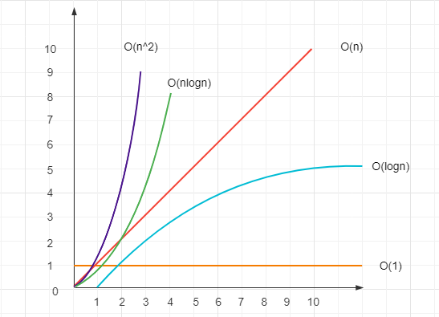

# Algorithm

- [基础知识](#基础知识)
- [排序](#排序)
- [二分查找](#二分查找)
  - [35.搜索插入位置](#35搜索插入位置)
  - [69.x 的平方根](#69x-的平方根)
- [动态规划](#动态规划)
- [排列组合](#排列组合)
  - [77.组合](#77组合)
  - [SKU 对象排列组合](#sku-对象排列组合)
- [双指针](#双指针)
  - [415.字符串相加](#415字符串相加)
- [滑动窗口](#滑动窗口)
  - [3.无重复字符的最长子串](#3无重复字符的最长子串)
- [栈](#栈)
  - [20.有效的括号](#20有效的括号)
- [树](#树)
  - [DFS 深度优先遍历](#dfs-深度优先遍历)
    - [200.岛屿数量](#200岛屿数量)
    - [257.二叉树的所有路径](#257二叉树的所有路径)
  - [BFS 广度优先搜索](#bfs-广度优先搜索)
    - [94.二叉树的中序遍历](#94二叉树的中序遍历)
    - [104.二叉树的最大深度](#104二叉树的最大深度)
  - [226.翻转二叉树](#226翻转二叉树)
- [队列](#队列)
- [链表](#链表)
  - [206.反转链表](#206反转链表)
  - [21.合并两个有序链表](#21合并两个有序链表)
  - [141.环形链表](#141环形链表)
  - [160.相交链表](#160相交链表)
  - [234.回文链表](#234回文链表)
- [贪心算法](#贪心算法)
  - [121.买卖股票的最佳时机](#121买卖股票的最佳时机)
  - [455.分发饼干](#455分发饼干)
- [回溯](#回溯)
- [洗牌算法](#洗牌算法)
- [LRU](#lru)
- [位运算](#位运算)
  - [位运算应用](#位运算应用)
  - [169.多数元素](#169多数元素)
  - [136.只出现一次的数字](#136只出现一次的数字)
- [经典例题](#经典例题)
  - [把一个数组旋转 K 步](#把一个数组旋转-k-步)
  - [24.交换链表节点](#24交换链表节点)
  - [N 数之和](#n-数之和)
    - [15.三数之和](#15三数之和)
  - [394.字符串解码](#394字符串解码)
  - [51.N 皇后](#51n-皇后)
  - [165.比较版本号](#165比较版本号)
  - [403.青蛙过河](#403青蛙过河)
  - [剑指 Offer 22.链表中倒数第k个节点](#剑指-offer-22链表中倒数第k个节点)
  - [122.买卖股票的最佳时机 II](#122买卖股票的最佳时机-ii)
  - [67.二进制求和](#67二进制求和)
  - [300. 最长递增子序列](#300-最长递增子序列)

## 基础知识

1. 时间复杂度，空间复杂度
2. 执行时间测试 `console.time()` 和 `console.timeEnd()`



## 排序

地址: [Sort](./sort/README.md)

## 二分查找

二分查找 (Binary Search)，也称折半查找。

要求:

- 线性表必须采用顺序存储结构（比如数组）
- 表中元素按关键字有序排列

思路：  

1. 从数组中间元素开始，如果是 目标，则返回该元素
2. 如果不是，利用中间元素分为前后两个子数组，
   1. 目标 小于中间元素，查找前一个数组
   2. 目标 大于中间元素，查找后一个数组
3. 重复以上动作，直到找到满足条件的元素。不满足则返回 -1

算法时间复杂度: O(log n)

```js
// 方法一 while 循环
function binary_search (arr , item){
  if (arr.length === 0) return -1;

  let low = 0
  let height = arr.length - 1
  while(low < height) {
    const mid = parseInt((height + low) / 2)

    if(arr[mid] == item){
      return mid
    }else if(arr[mid] > item){
      height = mid - 1
    }else{
      low = mid + 1
    }
  }
  return -1
}

// 方法二 递归
const binarySearch1 = function(
  arr,
  target,
  startIndex = 0,
  endIndex
) {
  if (arr.length === 0) return -1;
  if (!endIndex) endIndex = arr.length - 1;

  // 递归结束条件
  if (startIndex > endIndex) return -1;

  const midIndex = Math.floor((startIndex + endIndex) / 2);

  if (target < arr[midIndex]) {
    return binarySearch1(arr, target, startIndex, midIndex - 1);
  } else if (target > arr[midIndex]) {
    return binarySearch1(arr, target, midIndex + 1, endIndex);
  } else {
    return midIndex;
  }
};
```

### 35.搜索插入位置

[35.搜索插入位置](https://leetcode.cn/problems/search-insert-position/)

题目：给定一个排序数组和一个目标值，在数组中找到目标值，并返回其索引。如果目标值不存在于数组中，返回它将会被按顺序插入的位置。

请必须使用时间复杂度为 O(log n) 的算法。

```js
var searchInsert = function(nums, target) {
    let len = nums.length
    let left = 0, right = len - 1, ans = len

    while(left <= right) {
        let mid = left + Math.ceil((right - left)/2)

        if (target <= nums[mid]) {
          ans = mid
          right = mid - 1
        } else {
          left = mid + 1
        }
    }
    return ans
};
```

### 69.x 的平方根

[69. x 的平方根](https://leetcode.cn/problems/sqrtx/description/)

给你一个非负整数 x ，计算并返回 x 的 算术平方根 。
由于返回类型是整数，结果只保留 整数部分 ，小数部分将被 舍去 。
示例 1：
输入：x = 4
输出：2

示例 2：
输入：x = 8
输出：2
解释：8 的算术平方根是 2.82842..., 由于返回类型是整数，小数部分将被舍去。

```js
// 一
var mySqrt = function(x) {
    if (x < 2) return x

    let l = 1, r = x

    while (l <= r) {
        let mid = Math.floor(l + (r - l)/2)

        if (mid * mid === x) return mid

        if (mid * mid < x) {
            l = mid + 1
            if (l * l > x) return mid
        } else {
            r = mid - 1
        }
    }
};

// 二
// var mySqrt = function(x) {
//   if (x < 2) return x
//   let left = 2, mid, right = Math.floor(x / 2);
//   while (left <= right) {
//     mid = Math.floor(left + (right - left) / 2)
//     if (mid * mid === x) return mid
//     if (mid * mid < x) {
//         left = mid + 1
//     }else {
//         right = mid - 1
//     }
//   }
//   return right
// };
```

## 动态规划

[dynamic program](./dp/README.md)

## 排列组合

排列组合例题，递归回溯法

### 77.组合

[77. 组合](https://leetcode.cn/problems/combinations/)

给定两个整数 n 和 k，返回 1 ... n 中所有可能的 k 个数的组合。

思想：

1. 直接方法是 for 循环，k 层循环。
2. 第二个方法是 回溯
   1. 将问题抽象为 树形结构（N叉树）
   2. n 为树的宽度，k 为树的深度
   3. 把到达 子叶点的结果收集起来，求得 组合集合

```js
const combine = function(n, k) {
  let res = []

  function helper(start, path) { // start是枚举选择的起点 path是当前构建的路径（组合）
    if (path.length === k) {
      res.push(path.slice()) // 拷贝一份 path，推入 res
      return
    }

    for (let i = start; i <= n; i++) {
      path.push(i)
      helper(i + 1, path)
      path.pop() // 撤销选择
    }
  }

  helper(1, [])
  return res
}
```

方法二

```js
var combine = function(n, k) {
  let result = []
  let path = []

  const combineHelper  = (n, k, startIndex) => {
    if (path.length === k) {
      result.push([...path])
      return
    }

    for (let i = startIndex; i<= n - (k-path.length) + 1; i++) {
      path.push(i)
      combineHelper(n, k, i+1)
      path.pop()
    }
  }

  combineHelper(n, k, 1)
  return result
}
```

### SKU 对象排列组合

```js
let names = ["iPhone X", "iPhone XS"]

let colors = ["黑色", "白色"]

let storages = ["64g", "256g"]

function combine(...chunks) {
  let res = []

  let helper = function(chunkIndex, pre) {
    let chunk = chunks[chunkIndex]
    let isLast = chunkIndex === chunks.length - 1

    for (let val of chunk) {
      // push 的返回值是数组长度
      // concat 的返回值是合并后的数组，所以用 concat
      let cur = pre.concat(val)

      if (isLast) {
        res.push(cur)
      } else {
        helper(chunkIndex + 1, cur)
      }
    }
  }

  helper(0, [])
  return res
}

combine(names, colors, storages)
```

## 双指针

### 415.字符串相加

[415.字符串相加](https://leetcode.cn/problems/add-strings/)

```js
// 模拟加法
// 从两个数最低位开始： i, j 指向 num1, num2 尾部
// 相加计算是否进位： add 为上一步超出 10 的部分， add = res%10
// 添加当前位：对位数较短的数字进行 补零操作
var addStrings = function(num1, num2) {
    let i = num1.length - 1
    let j = num2.length - 1
    let add = 0
    const ans = []
    
    while (i >= 0 || j >= 0 || add != 0) {
        const x = i >= 0 ? num1.charAt(i) - '0' : 0;
        const y = j >= 0 ? num2.charAt(j) - '0' : 0;

        const result = x + y + add;
        ans.push(result % 10);

        add = Math.floor(result / 10);

        i--;
        j--;
    }

    return ans.reverse().join('');
};
```

## 滑动窗口

其实也是 双指针，left 和 right， 形成一个窗口

### 3.无重复字符的最长子串

地址：[3. 无重复字符的最长子串](https://leetcode-cn.com/problems/longest-substring-without-repeating-characters/)

```js
var lengthOfLongestSubstring = function (s) {
  let left = 0
  let res = 0
  let map = new Map()

  for (let r = 0; r < s.length; r++) {
    if (map.has(s[r]) && map.get(s[r]) >= left) {
      left = map.get(s[r]) + 1
    }
    res = Math.max(res, r - left + 1)
    map.set(s[r], r)
  }
  return res
}
```

## 栈

### 20.有效的括号

地址：[20. 有效的括号](https://leetcode-cn.com/problems/valid-parentheses/)

```js
// shift unshift
var isValid = function(s) {
    if (s && s.length%2 === 1) return false

    const valMap = {
        '(': ')',
        '[': ']',
        '{': '}'
    }

    const stack = []

    for (let i = 0; i<s.length; i++) {
        if (stack[0] && stack[0] === s[i]) {
            stack.shift()
        } else {
            stack.unshift(valMap[s[i]])
        }
    }

    return (stack.length === 0)
};

var isValid = function(s) {
    if (!s || s.length < 2) return false
    
    let stack = []
    const map = {
        "}": "{",
        "]": "[",
        ")": "("
    }

    for (let i of s) {
        let len = stack.length
        if (map[i]) {
            if (!len || stack[len - 1] !== map[i]) return false

            stack.pop()
        } else {
            stack.push(i)
        }
    }

    return !stack.length
};

// pop push
var isValid = function(s) {
    if(s.length%2 !== 0) return false
    const map =  {
        '(': ')',
        '{': '}',
        '[': ']'
    }
    const stack = [];
    
    for (let i = 0; i < s.length; i++) {
        let el = s[i];
        if (map[el]) {
            stack.push(map[el]);
        } else {
            if (el !== stack.pop()) {
                return false;
            }
        }
    }
    
    return stack.length === 0;
}
```

## 树

二叉树，非线性数据结构；根节点，表示最顶层节点；叶节点，表示没有子节点的节点；

深度：从根节点开始，沿着树的路径，逐层向下递增，直到到达叶节点；

前序、中序、后序都属于 深度优先遍历；先走到叶子节点，再回溯；

二叉树的遍历：

- 前序遍历：根节点、左子树、右子树
- 中序遍历：左子树、根节点、右子树
- 后序遍历：左子树、右子树、根节点

```js
class TreeNode {
  constructor(val) {
    this.val = val || 0
    this.left = null
    this.right = null
  }
}

// 插入和删除节点
let node = new TreeNode(1)
let n1 = new TreeNode(2)
let n2 = new TreeNode(3)
// n1 和 n2 中间插入 node
n1.left = node
node.left = n2;
n1.left = n2;

class BinarySearchTree {
  constructor() {
    this.root = null
  }

  insert(val) {
    let node = new TreeNode(val)

    if (!this.root) {
      this.root = node
      return
    }

    let cur = this.root
    while (cur) {
      if (val < cur.val) {
        if (!cur.left) {  
          cur.left = node
          return
        }
        cur = cur.left
      } else {
        if (!cur.right) {
          cur.right = node
          return
        }
        cur = cur.right
      }
    }
  }
}

```

### DFS 深度优先遍历

DFS Depth-First Search

- 利用栈特性, 先入后出, push, pop
- 以纵向的维度对 DOM 树进行遍历, 从最顶向左下遍历
- 直到所有子节点遍历完毕, 再返回遍历兄弟节点

比如遍历一个 DOM 结构, 从算法的角度

| 1       | 2   | 3      |
| :------ | --- | ------ |
| -       | div | -      |
| ui      | p   | button |
| li - li | - | - |
| a       | - | - |

```js
// DOM 树
let tree =  {
  id: '1',
  title: 'div',
  children: [
    {
      id: '1-1',
      title: 'ul',
      children: [
        {
          id: '1-1-1',
          title: 'li',
          children: [
            {
              id: '1-1-1-1',
              title: 'a'
            }
          ]
        },
        {
          id: '1-1-2',
          title: 'li'
        }
      ]
    }, 
    {
      id: '1-2',
      title: 'p'
    },
    {
      id: '1-3',
      title: 'button'
    }
  ]
}
```

1. 递归版本

    ```js
    function dfs(node, nodeList = []) {
      if (node) {
        nodeList.push(node)
        if(node.children && node.children.length>0){
          const child = node.children
          for(let i = 0; i<child.length; i++) {
            dfs(child[i], nodeList)
          }
        }
      }
      return nodeList
    }
    // div ul li a li p button
    ```

2. 非递归版

    ```js
    function dfs(node) {
      let nodes = []

      if (node) {
        let stack = []
        stack.push(node)

        while(stack.length) {
          const item = stack.pop()
          const child = item.children
          
          nodes.push(item)
          if (child && child.length > 0) {
            for(let i = child.length - 1; i >= 0; i--) {
              stack.push(child[i])
            }
          }
        }
      }

      return nodes
    }
    ```

例题：

#### 200.岛屿数量

leetcode: [200. 岛屿数量](https://leetcode.cn/problems/number-of-islands/)

思路: 把当前为 1 的点变为 0, 并使用  dfs 查找出来上下左右的点 变为 0

```js
var numIslands = function(grid) {
    let res = 0
    const row = grid.length
    const col = grid[0].length

    function dfs(x, y) {
        grid[x][y] = 0
        if (x > 0 && grid[x - 1][y] === "1") dfs(x - 1, y)
        if (x < row -1 && grid[x + 1][y] === "1") dfs(x + 1, y)
        if (grid[x][y - 1] === "1") dfs(x, y - 1)
        if (grid[x][y + 1] === "1") dfs(x, y + 1)
    }
      
    for (let i = 0; i < row; i ++) {
        for (let j = 0; j < col; j++) {
            if (grid[i][j] === "1") {
                dfs(i, j)
                res ++
            }
        }
    }
    return res
};
```

#### 257.二叉树的所有路径

leetcode: [257. 二叉树的所有路径](https://leetcode-cn.com/problems/binary-tree-paths/)

给定一个二叉树，返回所有从根节点到叶子节点的路径

```js

var binaryTreePaths = function(root) {
  const res = []
  const helper = (root, path) => {
    if (root) {
      path += root.val.toString()
      
      if (root.left === null && root.right === null) {
        res.push(path)
      } else {
        path += "->"
        helper(root.left, path)
        helper(root.right, path)
      }
    }
  }

  helper(root, "")
  return res
};
```

### BFS 广度优先搜索

广度优先遍历 breadth-first traversal，一行一行遍历，借助 “队列”实现，队列 “先进先出”，遍历则 “逐层推进”

BFS Breath-First Search

- 维护一个 queue 队列, 先进先出 push, shift
- 在读取子节点的时候同时把发现的孙子节点 push 到队列中，但是先不处理，
- 等到这一轮队列中的子节点处理完成以后
- 下一轮再继续处理的就是孙子节点了，这就实现了层序遍历

1. 递归版本

    ```js
    function bfs(node, nodeList = []) {
      if (node) {
        nodeList.push(node)
        if(node.children && node.children.length>0){
          const child = node.children
          for(let i = 0; i<child.length; i++) {
            bfs(child[i], nodeList)
          }
        }
        while(node) {
          bfs()
          node.children
        }
      }
      return nodeList
    }

    ```

2. 非递归版

    ```js
    function bfs(root) {
      const queue = [root]

      while (queue.length > 0) {  
        const node = queue.shift(); // 取出队首元素并移除  
        console.log(node.value); // 访问当前节点  
        if (node.left !== null) queue.push(node.left); // 将左子节点入队  
        if (node.right !== null) queue.push(node.right); // 将右子节点入队  
      }  

      return root
    }
    ```

例题：

一、[515. 在每个树行中找最大值](https://leetcode-cn.com/problems/find-largest-value-in-each-tree-row/)

```js
var largestValues = function(root) {
  if (!root) return []
  
  const res = []
  const queue = [root]

  while(queue.length) {
    const len = queue.length
    let cur = Number.MIN_SAFE_INTEGER

    for (let i = 0; i < len; i++) {
      // 取出当前 node
      const node = queue.shift()
      cur = Math.max(cur, node.val)

      node.left && queue.push(node.left)
      node.right && queue.push(node.right)
    }
    res.push(cur)
  }
  return res
}
```

#### 94.二叉树的中序遍历

[94.二叉树的中序遍历](https://leetcode.cn/problems/binary-tree-inorder-traversal/)

题目：给定一个二叉树的根节点 root ，返回 它的 中序 遍历 。

```js
// 迭代
var inorderTraversal = function(root) {
    const res = []
    const stack = []

    while(root || stack.length) {
        while(root) {
            stack.push(root)
            root = root.left
        }
        root = stack.pop()
        res.push(root.val)
        root = root.right
    }
    return res
}
```

#### 104.二叉树的最大深度

[104. 二叉树的最大深度](https://leetcode.cn/problems/maximum-depth-of-binary-tree/)

```js
// DFS
// 深度遍历
var maxDepth = function(root) {
  if (!root) return 0

  const left = maxDepth(root.left)
  const right = maxDepth(root.right)

  return Math.max(left, right) + 1
};
```

### 226.翻转二叉树

[226. 翻转二叉树](https://leetcode.cn/problems/invert-binary-tree/)

给你一棵二叉树的根节点 root ，翻转这棵二叉树，并返回其根节点。

```js
// 递归
// 基于 DFS
var invertTree = function(root) {
  if (!root) return root

  const temp = root.left
  root.left = root.right
  root.right = temp

  invertTree(root.left)
  invertTree(root.right)

  return root
};

// 遍历 BFS
// 层序遍历
// 根节点入列，然后出列，出列就交接左右子节点
// 然后左右子节点入列
// 直到队列为空
var invertTree = function(root) {
  if (!root) return root

  const queue = [root]

  while(queue.length) {
    const cur = queue.shift();
    // [cur.left, cur.right] = [cur.right, cur.left]
    const temp = cur.left
    cur.left = cur.right
    cur.right = temp

    if (cur.left) queue.push(cur.left)
    if (cur.right) queue.push(cur.right) 
  }

  return root
};
```

## 队列

队列，先进先出的结构

例题：

一、[使用栈实现队列](https://leetcode-cn.com/problems/implement-queue-using-stacks/)

参考 `webpack` 源码 [ArrayQueue.js](https://github.com/webpack/webpack/blob/main/lib/util/ArrayQueue.js)

```js
var MyQueue = function() {
    this._stack1 = [];
    this._stack2 = [];
};

MyQueue.prototype.push = function(x) {
    this._stack1.push(x)
};

MyQueue.prototype.pop = function() {
    // if (this._stack2.length === 0) {
    //     this._stack2 = this._stack1
    //     this._stack2.reverse();
    //     this._stack1 = []
    // }
    // return this._stack2.pop()

    // 或者
    if (this._stack2.length === 0) {
      while(this._stack1.length) {
        this._stack2.push(this._stack1.pop())
      }
    }
    return this._stack2.pop()
};

MyQueue.prototype.peek = function() {
    if (this._stack2.length === 0) {
        return this._stack1[0];
    }
    return this._stack2[this._stack2.length - 1];
};

MyQueue.prototype.empty = function() {
    return !(this._stack1.length + this._stack2.length)
};
```

## 链表

类似数组，不过是无序存储结构。含义见 [链表](../dataStruct/README.md)

```js
// 单链表
function createLinkList(arr) {
  const len = arr.length
  if (!len) throw new Error('arr is empty')

  let node = {
    value: arr[len-1]
  }

  if (len === 1) return node

  for(let i = len -2; i >=0; i--) {
    node = {
      value: arr[i],
      next: node
    }
  }

  return node
}
```

### 206.反转链表

[206.反转链表](https://leetcode.cn/problems/reverse-linked-list/)

```js
// 迭代
function reverseLinkList(head) {
  let preNode = null
  let curNode = head

  while(curNode) {
      let temp = curNode.next
      curNode.next = preNode
      preNode = curNode
      curNode = temp
  }

  return preNode
}

// 递归
// head(n) 的下一个节点(head(n+1))指向 head(n)
// head.next.next = head
// 并把下一个节点置空 head.next = null

var reverseList = function(head) {
    if (head == null || head.next == null) {
        return head;
    }

    const newHead = reverseList(head.next);
    head.next.next = head;
    head.next = null;
    return newHead;
};
```

### 21.合并两个有序链表

leetcode: [21. 合并两个有序链表](https://leetcode.cn/problems/merge-two-sorted-lists/)

```js
// 递归
var mergeTwoLists = function(list1, list2) {
  if (!list1) return list2
  if (!list2) return list1

  if (list1.val < list2.val) {
    list1.next = mergeTwoLists(list1.next, list2)
    return list1
  } else {
    list2.next = mergeTwoLists(list2.next, list1)
    return list2
  }
};

// 非递归
var mergeTwoLists = function(list1, list2) {
  let head = new ListNode()
  let cur = head // 中间变量
  while(list1 && list2) {
    if(list1.val <= list2.val) {
      cur.next = list1
      list1 = list1.next
    } else {
      cur.next = list2
      list2 = list2.next
    }
    cur = cur.next
  }
  
  cur.next = list1 !== null ? list1: list2
  return head.next
}
```

### 141.环形链表

[141. 环形链表](https://leetcode.cn/problems/linked-list-cycle/)

题目：给你一个链表的头节点 head ，判断链表中是否有环。存在环 ，则返回 true 。 否则，返回 false 。

```js
var hasCycle = function(head) {
    // 标记法
    while (head) {
        if (head.tag) {
        return true;
        }
        head.tag = true;
        head = head.next;
    }
    return false;

    // 快慢指针
    // if (head == null) return false
    // let slow = head
    // let fast = head.next
    // while(slow != fast) {
    //     if (fast == null || fast.next == null) return false

    //     slow = slow.next
    //     fast = fast.next.next // 只走一步，会陷入循环；快指针要多一步，才能追到慢指针
    // }
    // return true
};
```

### 160.相交链表

[160. 相交链表](https://leetcode.cn/problems/intersection-of-two-linked-lists/)

方法：1. hashMap；2.双指针；3.暴力法

```js
// 双指针
/**
 * @param {ListNode} headA
 * @param {ListNode} headB
 * @return {ListNode}
 */
var getIntersectionNode = function(headA, headB) {
  if (!headA || !headB) return null

  let a=headA
  let b=headB

  while(a !== b) {
      a = a === null ? headB : a.next
      b = b === null ? headA : b.next
  }

  return a
}
```

### 234.回文链表

[234. 回文链表](https://leetcode.cn/problems/palindrome-linked-list/)

题目：给你一个单链表的头节点 head ，请你判断该链表是否为回文链表。如果是，返回 true ；否则，返回 false 。

```js
var isPalindrome = function(head) {
    // 双指针
    const reverseList = (head) => {
        let prev = null;
        let curr = head;
        while (curr !== null) {
            let nextTemp = curr.next;
            curr.next = prev;
            prev = curr;
            curr = nextTemp;
        }
        return prev;
    }

    const endOfFirstHalf = (head) => {
        let fast = head;
        let slow = head;
        while (fast.next !== null && fast.next.next !== null) {
            fast = fast.next.next;
            slow = slow.next;
        }
        return slow;
    }


    // 找到前半部分链表的尾节点并反转后半部分链表
    const firstHalfEnd = endOfFirstHalf(head);
    const secondHalfStart = reverseList(firstHalfEnd.next);

    // 判断是否回文
    let p1 = head;
    let p2 = secondHalfStart;
    let result = true;
    while (result && p2 != null) {
        if (p1.val != p2.val) result = false;
        p1 = p1.next;
        p2 = p2.next;
    }

    return result
}
```

## 贪心算法

贪心算法（Greedy Algorithm）是一种在每一步选择中都采取在当前状态下最好或最优（即最有利）的选择，从而希望导致结果是全局最好或最优的算法。贪心算法通常有**自顶向下**的搜索方式，以迭代的方式做出相继的选择，每做一次选择就将所求问题简化为一个规模更小的子问题。

贪心算法的主要特点是：

贪心选择性质：所求问题的整体最优解可以通过一系列局部最优的选择来达到。
最优子结构性质：当一个问题的最优解包含其子问题的最优解时，称此问题具有最优子结构性质。

### 121.买卖股票的最佳时机

[121. 买卖股票的最佳时机](https://leetcode.cn/problems/best-time-to-buy-and-sell-stock/)

给定一个数组 prices ，它的第 i 个元素 prices[i] 表示一支给定股票第 i 天的价格。

你只能选择 某一天 买入这只股票，并选择在 未来的某一个不同的日子 卖出该股票。设计一个算法来计算你所能获取的最大利润。

返回你可以从这笔交易中获取的最大利润。如果你不能获取任何利润，返回 0 。

```js
// 遍历
// 贪心的想法就是取最左最小值，取最右最大值，那么得到的差值就是最大利润。
var maxProfit = function(prices) {
  if (prices.length <= 1) return 0
  let inV = 0
  let res = 0

  for (let i = 1; i<prices.length; i++) {

    if (prices[i] - prices[inV] > res) {
      res = prices[i] - prices[inV]
    }

    if (prices[i] < prices[inV]) {
      inV = i
    }
  }
  return res
};

```

### 455.分发饼干

一、[455. 分发饼干](https://leetcode-cn.com/problems/assign-cookies/)

排序 + 贪心

```js
var findContentChildren = function(g, s) {
  let i = g.length, j = s.length - 1
  g.sort((a, b) => a - b)
  s.sort((a, b) => a - b)

  while(i--) {
    if (s[j] >= g[i]) {
      if (j-- === 0) break
    }
  }
  return s.length - j -1
}
```

## 回溯

如果解决一个问题有多个步骤，每一个步骤有多种方法，题目又要我们找出所有的方法，可以使用回溯算法；回溯是在一颗树上 深度优先遍历（要找出所有的解）；

- 遍历枚举出所有可能的选择。（根据起点，画出二叉树）
- 依次尝试这些选择：作出一种选择，并往下递归。（剪枝）
- 如果这个选择产生不出正确的解，要撤销这个选择，回到之前的状态，并作出下一个可用的选择。

例题：

一、51. N 皇后

见下面: [51.N 皇后](#51n-皇后)

## 洗牌算法

链接: [shuffle](./shuffle/README.md)

## LRU

最久未使用 (`least recently used`)，LRU 算法又叫淘汰算法,根据数据历史访问记录进行淘汰数据；

核心思想： “如果数据最近被访问过, 那么将来被访问的几率也更高”。

LRU 在 Vue 的 `keep-alive` 中有使用

利用 Map 的 key 的有序性，Map 会记住键值对的插入顺序。

```js
class LRUCache {
  constructor(n) {
    this.size = n
    this.data = new Map()
  }
  put(domain, info) {
    if(this.map.has(key)) this.map.delete(key)

    if(this.data.size >= this.size) {
      // 删除最久没有用到的数据
      const firstKey= [...this.data.keys()][0]
      this.data.delete(firstKey)
    }
    this.data.set(domain, info)
  }
  get(domain) {
    if(!this.data.has(domain)) return -1

    const info = this.data.get(domain)
    this.data.delete(domain)
    this.data.set(domain, info)
    return info
  }
}
```

## 位运算

计算机的数字在内存中都是以二进制存储的（0 和 1 组成），位运算就是对二进制进行计算。

`&`: 与，两者都为 1，才为 1  
`|`: 或，两者都为 0， 才为 0  
`^`: 异或，两者相同为 0，相异为 1  
`~`: 按位非，0 变 1，1 变 0，运算时 `~x = -(x+1)`  
`<<`: 左移，左移 n 位，左边超出丢弃，右边补 0  
`>>`: 右移，右移 n 位；无符号，左边补 0，有符号，编译器处理方式不一样。

异或运算性质：

1. 任何数和 000 做异或运算，结果仍然是原来的数，即 `a^0=a`
2. 任何数和其自身做异或运算，结果是 0，即 `a^a=0`
3. 异或运算满足交换律和结合律，即 `a^b^a = b^a^a = b^(a^a) = b^0=b`。

异或是机器码运算，相同为 0 不同为 1，不管数字先后，只要两个数字相同对应的二进制都会被异或为 00000000，最后剩下的就是所要找的值

负数的位运算：

负数的位运算建立在它的补码上，正数的补码是它本身，负数的补码是，符号位（左边最高位，1为负数，0为正数）不变，其余按位取反。最后再 +1.

```js
// 15，原码:00001111   补码:00001111

// −15,原码:10001111   补码:11110001

```

### 位运算应用

1. 实现乘除法

   ```js
   a << 1 = a*2
   a >> 1 = a/2
   ```

2. 判断奇偶数  
  二进制中，最低位（最后一位）决定了是奇数还是偶数。与 1 相与即可实现目的，为 0 则是偶数，为 1 则是奇数。
  
    ```js
    // 常用的奇偶判断
    // num % 2 == 0

    // 位运算
    // nunm & 1 
    ```

    注意：由于 `==` 的优先级比 `&` 打，所以判断的时候，记得加括号，即 `(num&1) === 1` 为 `true`

3. 求负数绝对值(整数)

   ```js
    getAbs(a) {
      return a > 0 ? a : (~a+1)
    }
   ```

4. 交换两数，不需要临时变量

    ```js
    function swap(a, b) {
      // 普通操作
      let temp = a
      a = b
      b = temp
      // 或者
      a = a+b
      b = a-b
      a = a-b
      // 位运算
      a ^= b
      b ^= a
      a ^= b
    }
    ```

5. 数组中其余出现两次，有一个数出现一次，找出这个数

    ```js
    // 利用 a ^ b ^ b =a
    // 讲数组的数 做 ^ 运算
    ```

### 169.多数元素

给定一个大小为 n 的数组 nums ，返回其中的多数元素。多数元素是指在数组中出现次数 大于 ⌊ n/2 ⌋ 的元素。

你可以假设数组是非空的，并且给定的数组总是存在多数元素。

```js
var majorityElement = function(nums) {
  // 栈降维
  // 相同 + 1，不同 -1
  // 因为相同的数大于一半, 所以剩下大于一半的那个
  let x = 0
  let m = 0

  for (let n of nums) {
    if (m === 0) x = n

    m += x === n ? 1 : -1
  }

  return x
};
```

### 136.只出现一次的数字

[136.只出现一次的数字](https://leetcode.cn/problems/single-number/)

题目：给你一个 非空 整数数组 nums ，除了某个元素只出现一次以外，其余每个元素均出现两次。找出那个只出现了一次的元素。

异或运算满足交换律, a^b^a=a^a^b=b, 因此 ans 相当于 nums[0]^nums[1]^nums[2]^nums[3]^nums[4]

0^任意值 = 任意值

```js
// hashMap

// 暴力法

// 排序 nlog(n)

// 异或
var singleNumber = function(nums) {
    let a = nums[0]

    if (nums.length > 1) {
        for (let i = 1; i<nums.length; i++) {
            a = a ^ nums[i]
        }
    }

    return a
}
```

## 经典例题

### 把一个数组旋转 K 步

题目：

1. 输入一个数组 `[1,2,3,4,5,6,7]`
2. `K=3`,  即旋转 3 步（即最前面，旋转到最后面）
3. 输出 `[5,6,7,1,2,3,4]`

两种思路：

- `pop`  队尾弹出，`unshift` 插入队首；时间复杂度 O(n^2)，unshift 时间复杂度 O(n); 空间复杂度 O(1)
- 数组分为两份，剪切数组尾部 k 个元素，放前面，`concat` 剩余的子数组；时间复杂度 O(1)；空间复杂度 O(n)

```js
// pop unshift
function rotateArr(arr, k) {
  const len = arr.length || 0
  if (len === k) return

  //1、abs表示取绝对值，如果传入的值是一个负数，那么会按照正数来进行处理，
  // 2、如果key和arr.length相等，那么则原数组不变，从而这里进行一步取余处理;
  // 3、如果key不是整数，那么在下方循环那么step就是NaN,NaN于任何值做比较都会返回false，下方循环就不会进入
  const step = Math.abs(k%len)
  for (let i = 0; i<step; i++) {
    const p = arr.pop()
    if (p != null) arr.unshift(p)
  }

  return arr
}

// pop 和 concat
function rotateArr1(arr, k) {
  const length = arr.length

  if(!k || length === 0) return arr
  const step = Math.abs(k % length)  //abs 取绝对值
  const part1 = arr.slice(-step)
  const part2 = arr.slice(0,length-step)
  const part3 = part1.concat(part2)
  return part3
}

```

### 24.交换链表节点

链接：[24. 两两交换链表中的节点](https://leetcode-cn.com/problems/swap-nodes-in-pairs/)

递归：

1. 终止条件：链表为空或只剩一个元素
2. 返回值：返回给上一层递归应该是已经交换好的子链表
3. 单次过程：head 和 next，next 接收上一级返回的子链表

```js
var swapPairs = function(head) {
  if (!head || !head.next) return head

  let next = head.next
  head.next = swapPairs(next.next)
  next.next = head

  return next
}
```

### N 数之和

诀窍:

- 暴力法
- 排序 + 双指针(左右指针) + 去重

一、 **双数之和**

1. 暴力法

    ```js
    const twoSum = function (nums, target) {
      for (let i = 0; i < nums.length-1; i++) {
        for (let j = i+1; j <nums.length; j++) {
          if (nums[i] + nums[j] === target) {
            return [i, j]
          }
        }
      }
    }
    ```

2. 哈希表

    ```js
    const twoSum = function (nums, target) {
      let map = new Map()
      for(let i = 0, len = nums.lengths; i< len; i++) {
        if (map.has(target - nums[i])) {
          return [ map.get(target - nums[i]), i ]
        } else {
          map.set(nums[i], i)
        }
      }
      return []
    }
    ```

#### 15.三数之和

地址: [3sum](https://leetcode-cn.com/problems/3sum/)

1. 暴力法, 3 个 `for` 循环
2. 排序 + 双指针

    ```js
    // 时间复杂度 O(n^2)
    // sort 排序可以做到 nlogn (nlogn < n^2)
    const threeSum = function(nums) {
      let res = []
      const len = nums.length
      if (nums === null || nums.length < 3) return res

      nums.sort((a, b) => a - b)

      for (let i =0; i<len; i++) {
        // 排序后 i 从左边遍历，作为第一个数
        // 当前数字大于 0，则三数之和大于0
        if (nums[i] > 0) break
        if (i>0 && nums[i] === nums[i-1]) continue; // 跳过，去重

        let l = i + 1
        let r = len - 1

        while(l<r) {
          const sum = nums[i] + nums[l] + nums[r]
          if (sum === 0) {
            res.push([nums[i], nums[l], nums[r]])
            while (l < r && nums[l] === nums[l+1]) l++
            while (l < r && nums[r] === nums[r-1]) r--

            l++
            r--
          }
          if (sum < 0) {
            l++
          }
          if (sum > 0) {
            r--
          }
        }
      }

      return res
    }
    ```

三、**四数之和**

leetcode: [4sum](https://leetcode-cn.com/problems/4sum/)

排序 + 双指针

```js
const fourSum = function(nums, target) {
  if (nums === null || nums.length < 4) return []
  let res = []
  let len = nums.length
  
  nums.sort((a, b) => a - b)

  for(let i = 0; i < len; i++) {
    if (i > 0 && nums[i] === nums[i-1]) continue
    for (let j = i + 1; j < len - 2; j++) {
      if (j > i + 1; nums[j] === nums[j-1]) continue

      let L = j + 1
      let R = len - 1
      while(L < R) {
        let sum = nums[i] + nums[j] + nums[L] + nums[R]
        if (sum === target) {
          res.push([nums[i], nums[j], nums[L], nums[R]])
          while(L < R && nums[L] === nums[L + 1]) L++
          while(L < R && nums[R] === nums[R - 1]) R--
          L++
          R-- 
        }
        else if (sum < target) L++
        else if (sum > target) R--
      }
    }
  }
  return res
}
```

四、**n 数之和**

```js
const nSum = function(nums, target) {
  const recursion = (index, N, temp) => {
    if (index === len || N < 3) return

    for(let i = index; i < len; i ++) {
      if (i > index && nums[i] === nums[i - 1]) continue

      if (N > 3) {
        recursion(i + 1, N - 1, [nums[i], ...temp])
        continue
      }

      // 3 数和
      let L = i + 1
      let R = len - 1
      while(L < R) {
        let sum = nums[i] + nums[L] + nums[R] + temp.reduce((x, y) => x + y)
        if (sum === target) {
          res.push([...temp, nums[i], nums[L], nums[R]])
          while(L < R && nums[L] === nums[L + 1]) L++
          while(L < R && nums[R] === nums[R - 1]) R--
          L++
          R-- 
        }
        else if (sum < target) L++
        else if (sum > target) R--
      }
    }
  }

  let res = []
  let len = nums.length
  nums.sort((a, b) => a - b)
  // 假如为 4 数之和, N = 4
  recursion(0, 4, [])
  return res
}
```

### 394.字符串解码

leetcode: [394. 字符串解码](https://leetcode-cn.com/problems/decode-string/)

```js
var decodeString = function(s) {
    let numStack = [];        // 存倍数的栈
    let strStack = [];        // 存 待拼接的str 的栈
    let num = 0;              // 倍数的“搬运工”
    let result = '';          // 字符串的“搬运工”
    for (const char of s) {   // 逐字符扫描
        if (!isNaN(char)) {   // 遇到数字
            num = num * 10 + Number(char); // 算出倍数
        } else if (char == '[') {  // 遇到 [
            strStack.push(result); // result串入栈
            result = '';           // 入栈后清零
            numStack.push(num);    // 倍数num进入栈等待
            num = 0;               // 入栈后清零
        } else if (char == ']') {  // 遇到 ]，两个栈的栈顶出栈
            let repeatTimes = numStack.pop(); // 获取拷贝次数
            result = strStack.pop() + result.repeat(repeatTimes); // 构建子串
        } else {                   
            result += char;        // 遇到字母，追加给result串
        }
    }
    return result;
};
```

### 51.N 皇后

链接: [51. N 皇后](https://leetcode-cn.com/problems/n-queens/)

假设: row 为行数, col 为列数

对角线[左下 -> 右上]: row + col
对角线[左上 -> 右下]: row - col

不能同行，同列，同对角线

```js
var solveNQueens = function(n) {
  let res = [], 
    queens = [] // 皇后每行位置数组

  // 判断位置是否可以放置
  let canPlace = (queens, row, col) => {
    for (let i = 0; i < queens.length; i++) {
      // i 是行, queens[i] 是列
      // 不能同行，同列，同对角线
      if (queens[i] === col) return false
      if (i + queens[i] == row + col || i - queens[i] == row - col) return false
      // if (Math.abs(row - i) === Math.abs(col - queens[i])) return false
    }

    return true
  }

  let dfs = (res, queens, n, row) => {
    if (row === n) {
      return res.push(queens.map(s => '.'.repeat(s) + 'Q' + '.'.repeat(n-s-1)))
    }

    for (let col = 0; col < n; col++) {
      if (!canPlace(queens, row, col)) continue
      queens[row] = col
      dfs(res, queens, n, row + 1)

      // 清空数组
      queens.splice(row, 1)
    }
  }

  dfs(res, queens, n, 0)
  return res
}
```

### 165.比较版本号

[165. 比较版本号](https://leetcode.cn/problems/compare-version-numbers/)

```js
var compareVersion = function(version1, version2) {
  // 字符串分割
  // const v1 = version1.split('.');
  // const v2 = version2.split('.');
  // for (let i = 0; i < v1.length || i < v2.length; ++i) {
  //     let x = 0, y = 0;
  //     if (i < v1.length) {
  //         x = parseInt(v1[i]);
  //     }
  //     if (i < v2.length) {
  //         y = parseInt(v2[i]);
  //     }
  //     if (x > y) {
  //         return 1;
  //     }
  //     if (x < y) {
  //         return -1;
  //     }
  // }
  // return 0;
  
  // 双指针
  const n = version1.length, m = version2.length;
  let i = 0, j = 0;
  while (i < n || j < m) {
      let x = 0;
      for (; i < n && version1[i] !== '.'; ++i) {
          x = x * 10 + version1[i].charCodeAt() - '0'.charCodeAt();
      }
      ++i; // 跳过点号
      let y = 0;
      for (; j < m && version2.charAt(j) !== '.'; ++j) {
          y = y * 10 + version2[j].charCodeAt() - '0'.charCodeAt();
      }
      ++j; // 跳过点号
      if (x !== y) {
          return x > y ? 1 : -1;
      }
  }
  return 0;
};
```

### 403.青蛙过河

链接: [403.青蛙过河](https://leetcode.cn/problems/frog-jump/)

```js
var canCross = function (stones) {
   const set = new Set()
   return helper(stones, 0, 0, set)
};
var helper = function (stones, index, k, set) {
    const key = index * 1000 + k
    if (set.has(key)) {
        return false
    } else {
        set.add(key)
    }
    for (let i = index + 1; i < stones.length; i++) {
        const gap = stones[i] - stones[index]
        if (gap >= k-1 && gap <= k+1) {
            if (helper(stones, i, gap, set)) {
                return true
            }
        } else if (gap > k+1) {
            break
        }
    }
    return index == stones.length - 1
}
```

### 剑指 Offer 22.链表中倒数第k个节点

输入一个链表，输出该链表中倒数第k个节点。为了符合大多数人的习惯，本题从1开始计数，即链表的尾节点是倒数第1个节点。

例如，一个链表有 6 个节点，从头节点开始，它们的值依次是 1、2、3、4、5、6。这个链表的倒数第 3 个节点是值为 4 的节点。

```js
/**
 * Definition for singly-linked list.
 * function ListNode(val) {
 *     this.val = val;
 *     this.next = null;
 * }
 */
/**
 * @param {ListNode} head
 * @param {number} k
 * @return {ListNode}
 */
var getKthFromEnd = function(head, k) {
  // 方式一：利用 map
  // const arr = new Map()
  // let i = 0

  // while (head) {
  //   arr.set(i, head)
  //   head = head.next
  //   i++
  // }

  // return arr.get(i - k)

  // 方式二：双指针
  let node = head, n = 0;
  while (node) {
      node = node.next;
      n++;
  }
  node = head;
  for (let i = 0; i < n - k; i++) {
      node = node.next;
  }
  return node;
};
```

### 122.买卖股票的最佳时机 II

给你一个整数数组 prices ，其中 prices[i] 表示某支股票第 i 天的价格。

在每一天，你可以决定是否购买和/或出售股票。你在任何时候 最多 只能持有 一股 股票。你也可以先购买，然后在 同一天 出售。

返回 你能获得的 最大 利润 。

输入：`prices = [7,1,5,3,6,4]`
输出：7
解释：在第 2 天（股票价格 = 1）的时候买入，在第 3 天（股票价格 = 5）的时候卖出, 这笔交易所能获得利润 = 5 - 1 = 4 。
     随后，在第 4 天（股票价格 = 3）的时候买入，在第 5 天（股票价格 = 6）的时候卖出, 这笔交易所能获得利润 = 6 - 3 = 3 。
     总利润为 4 + 3 = 7 。

```js
// 动态规划
// dp[i][0] 表示第 i 天交易完后手里没有股票的最大利润，dp[i][1] 表示第 i 天交易完后手里持有一支股票的最大利润（i 从 0 开始）。
// dp[i][0] = max{dp[i-1][0], dp[i-1][1] + prices[i]}
// dp[i][1] = max{dp[i-1][1], dp[i-1][0] - prices[i]}
var maxProfit = function(prices) {
  const n = prices.length;
  // const dp = new Array(n).fill(0).map(v => new Array(2).fill(0));
  // dp[0][0] = 0, dp[0][1] = -prices[0];
  // for (let i = 1; i < n; ++i) {
  //     dp[i][0] = Math.max(dp[i - 1][0], dp[i - 1][1] + prices[i]);
  //     dp[i][1] = Math.max(dp[i - 1][1], dp[i - 1][0] - prices[i]);
  // }
  // return dp[n - 1][0];

  let dp0 = 0, dp1 = -prices[0]

  for (let i = 1; i<n; i++) {
    let newDp0 = Math.max(dp0, dp1 + prices[i])
    let newDp1 = Math.max(dp1, dp0 - prices[i])

    dp0 = newDp0
    dp1 = newDp1
  }

  return dp0
};

// 贪心
// 求最大利润，而不求操作
// 所以 能赚钱，就头天买
// 第一天，盈利为 0
// 第二天，
// 如果 减前一天为 负，昨天不买入；今天不卖出，盈利为 0
// 为正数，昨天买入，今日卖出，盈利为正数
var maxProfit = function(prices) {
  let ans = 0
  for (let i =1, len = prices.length; i<len; i++) {
    ans = ans + Math.max(0, prices[i] - prices[i-1])
  }
  return ans
};
```

### 67.二进制求和

[67. 二进制求和](https://leetcode.cn/problems/add-binary/)

```js
var addBinary = function(a, b) {
  let ans = ''
  let num = 0 // 进位

  let i = a.length - 1
  let j = b.length - 1
  for (; i >= 0 || j >= 0; i--, j--) {

    let m = i >= 0 ? parseInt(a[i]) : 0
    let n = j >= 0 ? parseInt(b[j]) : 0
    // 补 0

    let sum = num
    sum = sum + m
    sum = sum + n


    ans = ans + sum%2 // 拼接 1
    num = Math.floor(sum/2)
  }

  ans = ans + (num == 1 ? num : '') // 判断最后是否进位
  return ans.split('').reverse().join('');
};
```

### 300. 最长递增子序列

[300. 最长递增子序列](https://leetcode.cn/problems/longest-increasing-subsequence/)

给你一个整数数组 nums ，找到其中最长严格递增子序列的长度。

子序列 是由数组派生而来的序列，删除（或不删除）数组中的元素而不改变其余元素的顺序。例如，[3,6,2,7] 是数组 [0,3,1,6,2,2,7] 的子序列。

<!-- 动态规划思路 + 二分 -->

测试用例：

```js
nums1 = [10,9,2,5,3,7,101,18]
// 输出：4
// 解释：最长递增子序列是 [2,3,7,101], 长度是 4。

nums2 = [0,1,0,3,2,3]
// 输出：4

nums3 = [7,7,7,7,7,7,7]
// 输出：1
```

题解：

```js
/**
 * @param {number[]} nums
 * @return {number}
**/

var lengthOfLIS = function(nums) {
  let f = [nums[0]]
  const binarySearch = (num) => {
    let left = 0, right = f.length;
    while (left < right) {
      // let mid = left + ((right - left) >> 1);
      let mid = left + ((right - left)/2);
      if (f[mid] < num) left = mid + 1;
      else right = mid;
    }
    return left
  }

  for (let i = 1; i < nums.length; i++) {
    if (nums[i] > f[f.length - 1]) {
      f.push(nums[i])
    } else {
      f[binarySearch(nums[i])] = nums[i]
    }
  }

  return f.length
}

```
