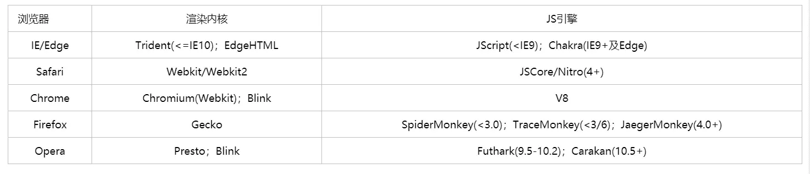

# 浏览器

- [浏览器](#浏览器)
  - [浏览器内核](#浏览器内核)
  - [JavaScript 引擎](#javascript-引擎)
  - [浏览器渲染](#浏览器渲染)
  - [浏览器缓存](#浏览器缓存)
    - [http 缓存](#http-缓存)
    - [本地缓存](#本地缓存)
  - [事件循环 Event Loop](#事件循环-event-loop)
    - [setTimeout](#settimeout)
    - [requestAnimationFrame](#requestanimationframe)
    - [requestIdleCallback](#requestidlecallback)
  - [浏览器的多线程](#浏览器的多线程)
  - [Web Worker](#web-worker)
  - [WebSocket](#websocket)
    - [WebSocket 心跳机制](#websocket-心跳机制)

## 浏览器内核

浏览器内核 ，可以理解为浏览器的心脏，是指浏览器最核心的部分，浏览器内核主要包含两部分：渲染引擎和 JS 引擎，但由于JS引擎越来越独立，浏览器内核就倾向于单指渲染引擎（Rendering Engine），所以我们常说的浏览器内核主要指的就是 **渲染引擎**。

浏览器内核（browser kernel）常表示 浏览器的排版引擎(Rendering Engine，layout engine)，也称浏览器引擎，页面渲染引擎，渲染内核等。



- Trident： Microsoft，该内核被认为是在早期IE浏览器中占主导地位，但现在也存在于其他一些浏览器中，如Edge。它对真正的网页标准支持不太好，且存在一些安全漏洞。
- Gecko：该内核主要用于 Firefox 火狐浏览器。它的优点是功能强大、丰富，可以支持很多复杂网页效果和浏览器扩展接口，但缺点是消耗较多的资源，如内存。
- Presto：（已弃用）该内核被称为公认的浏览网页速度最快的内核，同时也是处理 JS 脚本最兼容的内核，能在 Windows、Mac 及 Linux操作系统下完美运行。
- Webkit：Apple，该内核主要用于 Safari 浏览器，它的优点是具有清晰的源码结构、极快的渲染速度，但缺点是对网页代码的兼容性较低，可能导致一些编写不标准的网页无法正确显示。
  - Chromium：Google，基于 Webkit 再深度改装的内核，除了 Chrome，目前广泛应用于Sogou、360极速、世界之窗极速、百度、淘宝、猎豹等浏览器
  - Webkit2
  - Blink: Webkit 的一个分支, google 目前在使用

## JavaScript 引擎

javascript 是一门高级语言，CPU 只能识别机器语言；
JavaScript 引擎是用来渲染JavaScript的，javascript 引擎将 javascript 翻译成 CPU 指令，JavaScript的渲染速度越快，动态网页的展示也越快。

- SpiderMonkey: Brendan Eich(js作者) 开发
- JSCore: Webkit 中的 js 引擎，Apple 开发
- V8: Google 开发
- Chakra: 微软，IE 浏览器

## 浏览器渲染

- 解析渲染页面
  1. 构建 DOM 树
     - 遇到 script 标签，则 DOM 树的构建会暂停
  2. 构建 CSSOM 树
     - 解析 CSS 规则树时 js 执行将暂停，直至 CSS 规则树就绪
  3. 结合 DOM 树和 CSS 规则树，生成渲染树
  4. Reflow: 回流/重排，元素内容、结构、位置发送变化
  5. Repaint: 重绘，元素外观变化

## 浏览器缓存

### http 缓存

- 强缓存
  - expires
    - 过期时间(http1.0)
    - 绝对时间，修改本地客户端，会导致误判
  - cache-control
    - http1.1
    - max-age 相对时间
- 协商缓存
  - etag & if-none-match
    - 标志资源是否变化
    - etag值没有规定，可以是时间戳的哈希值，版本号等
  - last-modified & if-modified-since
    - 资源最后被修改的时间

缓存机制：  

- 强缓存生效则使用强缓存，失效则进行协商缓存
- cache-control 优先级高于 expires; etag 优先级高于 last-modified
- 协商缓存有服务器决定。生效则返回 304。

### 本地缓存

- localStorage
  - 浏览器端设置，永久存储，要手动清除
  - 存储格式是字符串，注意存对象取出来要格式化
  - 同源情况，即可获取
  - 每个网站限制 5MB
- sessionStorage
  - 浏览器端设置，窗口或页面关闭则清除
  - 同窗口才能获取
  
- cookie
  - 服务端设置，保存则客户端本地
  - 限制 4KB

## 事件循环 Event Loop

JavaScript 是单线程的, 为了防止用户交互, 脚本, UI 渲染和网络请求等行为, 防止主线程的不阻塞，Event Loop 的方案应用而生

Event Loop 包含两类

- Browsing Context
- Worker: 每一个 Web Worker 也有一个独立的 Event Loop

任务队列 task queue

为了协调事件循环中的同步任务和异步任务, 使用了任务队列机制

- 一个事件循环有一个或多个任务队列
- 任务队列是集合, 不是队列. 因为Event Loop第一步是选取队列中第一个可运行的任务, 而不是第一个任务
- 微任务队列不是任务队列

Event loop 每一次循环操作叫 `tick`

1. 执行最先进入队列的任务
2. 检查是否存在 microtack, 存在则不停执行, 直至清空 Mirotask queue
3. render 渲染
4. requestAnimationFrame
5. intersectionObserver
6. render 渲染
7. requestIdeleCallback 取第一个, 执行

宏任务 task: script(整体代码), setTimeout, setInterval, setImmediate

微任务 microtask: Promise.then, MutaionObserver, process.nextTick

async/await:

- chrome 70 版本

```js
async function async1(){
  await async2()
  console.log('async1 end')
}
// 等价于
async function async1() {
  return new Promise(resolve => {
    resolve(async2())
  }).then(() => {
    console.log('async1 end')
  })
}
```

- chrome 70 版本以上, await 将直接使用 Promise.resolve() 相同语义

### setTimeout

setTimeout:

- 浏览器设置最好间隔 4ms;
- 经过 5 重嵌套定时器之后，时间间隔被强制设定为至少 4 毫秒。
- 同步任务执行过久, 可能 setTimeout 时间不准

### requestAnimationFrame

- 回调执行与 宏任务微任务无关, 与浏览器是否渲染有关, 它是在浏览器渲染之前, 微任务执行后执行。
- 一般显示器屏幕为 60hz, 大约 16.7ms 执行一次

[深入requestAnimationFrame 执行机制](https://blog.51cto.com/feng/5289890)

setTimeout 和 requestAnimationFrame 区别

- 执行时机: requestAnimation 由系统决定执行时间, setTimeout的执行时间并不是确定的
- 节能: 页面未激活(隐藏, 最小化), requestAnimationFrame 暂停执行, setTimeout 会继续执行
- 函数节流: 防止刷新阶段, 防止函数执行多次
- 引擎: setTimeout JS 引擎, 存在事件队列. requestAnimationFrame 属于 GUI 引擎, 发生在渲染之前

### requestIdleCallback

requestIdleCallback 由 React fiber 引起关注. 用来判断浏览器渲染之后的空闲时间

requestAnimationFrame 每次渲染都执行

requestIdleCallback 渲染完空闲时才执行

## 浏览器的多线程

1. GUI 渲染线程
   - 绘制页面，解析 HTML、CSS，构建 DOM 树，布局和绘制等
   - 页面重绘和回流
   - 与 JS 引擎线程互斥，也就是所谓的 JS 执行阻塞页面更新
2. JS 引擎线程
    - 负责 JS 脚本代码的执行
    - 负责准执行准备好待执行的事件，即定时器计数结束，或异步请求成功并正确返回的事件
    - 与 GUI 渲染线程互斥，执行时间过长将阻塞页面的渲染
3. 事件触发线程
    - 将准备好的事件交给 JS 引擎线程执行
    - 多个事件加入任务队列的时候需要排队等待(JS 的单线程)
4. 定时器触发线程
   - 负责执行异步的定时器类的事件，如 setTimeout、setInterval
   - 定时器到时间之后把注册的回调加到任务队列的队尾
5. HTTP 请求线程
   - 负责执行异步请求
   - 该线程会把回调函数加入到任务队列的队尾等待执行

## Web Worker

- 由于 js 是单线程的，Web Worker 允许主线程外还存在一个线程
- 通过 postMessage 将结果回传到主线程

```js
let worker = new Worker("http://url.js")
worker.onmessage = function(e) {} // 监听返回的信息，e.data
worker.onerror = e => {} // 监听错误
worker.terminate() // 关闭Worker线程
```

关键：

- 分配给 Worker 线程的脚本文件必须和主线程的脚本文件同源
- Worker 不能读取本地文件（file://~），文件必须来自网络
- web worker 处于外部文件，无法访问到 winodow、document等

## WebSocket

以前客户端只能发送 ajax 请求与服务端通信，这样获取不到实时的服务端变化。WebSocket 使得前后端可以双向通讯，提高了通信效率

- WebSocket 是基于 TCP 协议进行全双工通讯的协议（应用层）
- 一次 TCP 握手，即可建立永久连接，并可双向传输数据

```js
let ws = new WebSocket(url)

ws.onopen = e => {
  console.log('连接成功', e)
  ws.send('我发送消息给服务端'); // 客户端与服务器端通信
}

ws.onmessage = e => {
  console.log('服务器端返回：', e.data)
}

Socket.send() // 使用连接发送数据
Socket.close() // 关闭连接
```

WebSocket的当前状态：WebSocket.readyState

- 0：正在连接
- 1：连接成功
- 2：连接正在关闭
- 3：连接已关闭

### WebSocket 心跳机制

WebSocket 有时候不稳定，需要检查心跳，心跳机制的时间可以自己与后端约定

```js
heartCheck() {
  this.pingPong = 'ping'; // ws的心跳机制状态值
  this.pingInterval = setInterval(() => {
    if (this.ws.readyState === 1) {
      this.ws.send('ping'); // 客户端发送ping
    }
  }, 10000)

  this.pongInterval = setInterval(() => {
    if (this.pingPong === 'ping') {
      // 没有返回 pong 重启webSocket
      // connect
    }
    // 重置为ping 
    // 若下一次 ping 发送失败 或 pong 返回失败，将重启
    this.pingPong = 'ping'
  }, 20000)
}
```
