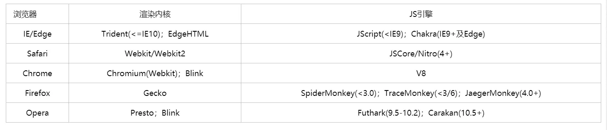
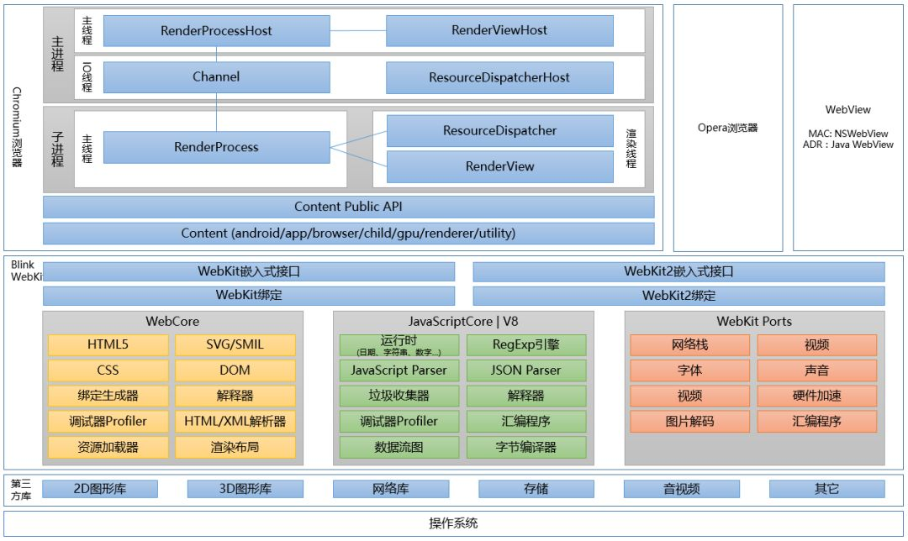
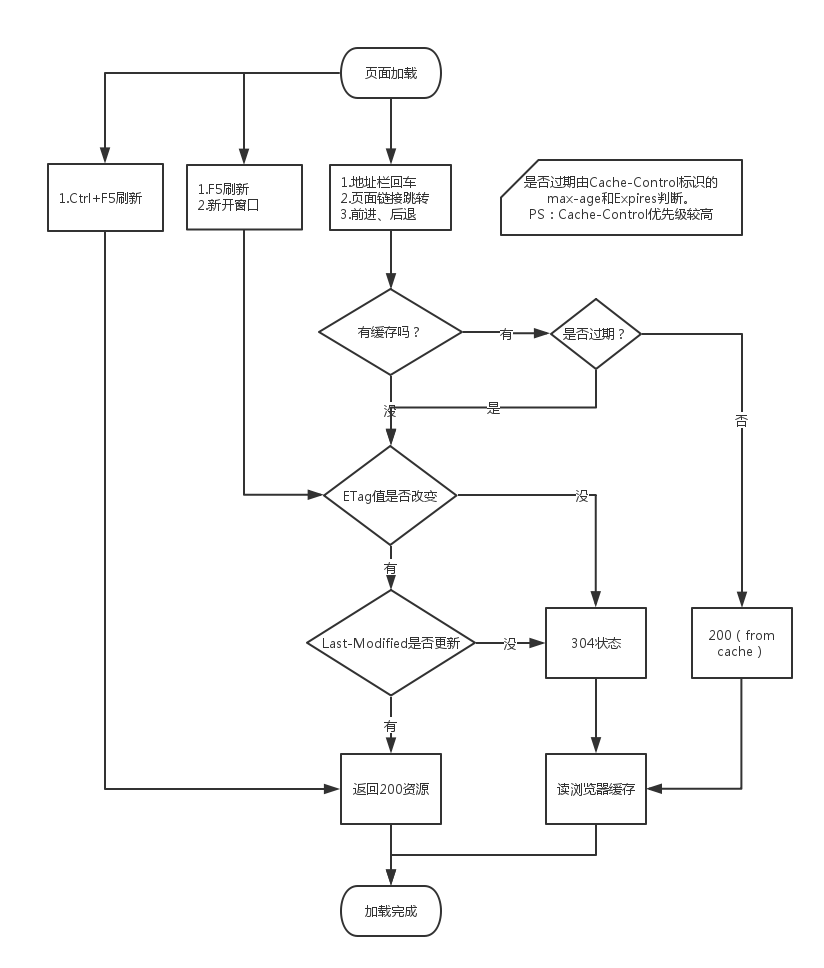

# 浏览器

- [浏览器内核(渲染引擎)](#浏览器内核渲染引擎)
- [JavaScript 引擎](#javascript-引擎)
  - [v8](#v8)
- [Chromium 浏览器架构](#chromium-浏览器架构)
- [浏览器渲染](#浏览器渲染)
- [缓存](#缓存)
  - [浏览器缓存](#浏览器缓存)
    - [Service Worker](#service-worker)
    - [强缓存](#强缓存)
    - [协商缓存](#协商缓存)
    - [浏览器缓存顺序](#浏览器缓存顺序)
  - [数据库缓存](#数据库缓存)
  - [本地缓存](#本地缓存)
    - [Cookie](#cookie)
    - [localStorage](#localstorage)
    - [sessionStorage](#sessionstorage)
  - [代理服务器缓存](#代理服务器缓存)
  - [CDN 缓存](#cdn-缓存)
- [事件循环 Event Loop](#事件循环-event-loop)
- [一帧发生的事情](#一帧发生的事情)
- [setTimeout](#settimeout)
- [requestAnimationFrame](#requestanimationframe)
  - [setTimeout 和 rAF](#settimeout-和-raf)
- [requestIdleCallback](#requestidlecallback)
- [浏览器的多线程](#浏览器的多线程)
- [Web Worker](#web-worker)
- [WebSocket](#websocket)
  - [WebSocket 心跳机制](#websocket-心跳机制)
- [从 url 输入到显示网页都发生了什么？](#从-url-输入到显示网页都发生了什么)

## 浏览器内核(渲染引擎)

浏览器内核主要包含两部分：渲染引擎和 JS 引擎，但由于 JS 引擎越来越独立，浏览器内核就倾向于单指渲染引擎（Rendering Engine），所以我们常说的浏览器内核主要指的就是 **渲染引擎**。

浏览器内核（browser kernel）常表示 浏览器的排版引擎(Rendering Engine，layout engine)，也称浏览器引擎，页面渲染引擎，渲染内核等。



- `Trident`： Microsoft，该内核被认为是在早期IE浏览器中占主导地位，但现在也存在于其他一些浏览器中，如 Edge。它对真正的网页标准支持不太好，且存在一些安全漏洞。
- `Gecko`：Mozilla，该内核主要用于 Firefox 火狐浏览器。它的优点是功能强大、丰富，可以支持很多复杂网页效果和浏览器扩展接口，但缺点是消耗较多的资源，如内存。
- `Presto`：（已弃用）该内核被称为公认的浏览网页速度最快的内核，同时也是处理 JS 脚本最兼容的内核，能在 Windows、Mac 及 Linux操作系统下完美运行。
- `Webkit`：Apple，该内核主要用于 Safari 浏览器，它的优点是具有清晰的源码结构、极快的渲染速度，但缺点是对网页代码的兼容性较低，可能导致一些编写不标准的网页无法正确显示。
  - `Chromium`：Google，基于 Webkit 再深度改装的内核，除了 Chrome，目前广泛应用于Sogou、360极速、世界之窗极速、百度、淘宝、猎豹等浏览器
  - `Webkit2`
  - `Blink`: Webkit 的一个分支, google 目前在使用

## JavaScript 引擎

JavaScript 是一门高级语言，CPU 只能识别机器语言；
JavaScript 引擎是用来渲染 JavaScript 的, JavaScript 引擎将 JavaScript 翻译成 CPU 指令，JavaScript 的渲染速度越快，动态网页的展示也越快。

- `SpiderMonkey`: Brendan Eich(js作者) 开发
- `JSCore`: Webkit 中的 js 引擎，Apple 开发
- `V8`: Google 开发，Blink
- `Chakra`: 微软，IE 浏览器

### v8

V8 是 Google 的开源高性能 JavaScript 和 WebAssembly 引擎，用 `C++` 编写，它实现 ECMAScript 和 WebAssembly，可独立运行或嵌入到任何 C++ 应用程序中，如 Chrome 和 Node.js。

## Chromium 浏览器架构

chrome 架构图：



- `WebCore`：WebKit 加载和渲染网页的基础，是不同浏览器所使用的 WebKit 中共享的部分，包括HTML解析器、CSS解析器、SVG、布局、渲染树等等；
- `JavaScript 引擎`：JavaScript 解析器，WebKit 默认的引擎是 JavaScriptCore，Google 的 Blink 为V8 引擎；
- `WebKit Ports`：WebKit中的移植部分，包括网络栈、音视频解码、硬件加速等模块，这部分对 WebKit 的功能和性能影响比较大。

## 浏览器渲染

- 解析渲染页面
  1. 构建 DOM 树
     - 遇到 script 标签，则 DOM 树的构建会暂停
  2. 构建 CSSOM 树
     - 解析 CSS 规则树时 js 执行将暂停，直至 CSS 规则树就绪
  3. 结合 DOM 树和 CSS 规则树，生成渲染树
  4. Reflow: 回流/重排，元素内容、结构、位置发送变化
  5. Repaint: 重绘，元素外观变化

## 缓存

缓存从微观上可以分为以下几类：

- 浏览器缓存（http缓存）
- 代理服务器缓存
- CDN 缓存
- 数据库缓存
- 应用层缓存（本地缓存）

### 浏览器缓存

也叫 `http` 缓存

Web 缓存的好处：

- 减小网络延迟，加快页面打开速度，从缓存请求内容比从源服务器所用时间更少，缓存的使用可以明显加快页面打开速度，达到更好的体验。
- 下降服务器的压力，给网络资源设定有效期以后，用户能够重复使用本地的缓存，减小对源服务器的请求，间接下降服务器的压力。
- 减小网络带宽损耗。不管对于网站运营者或者用户，带宽都表明着金钱。当 Web缓存副本被使用时，只会产生极小的网络流量，能够有效的下降运营成本。

#### Service Worker

用于浏览器缓存资源

如果网站中注册了 Service Worker 那么它可以拦截当前网站所有的请求，进行判断（需要编写相应的判断程序），如果需要向服务器发起请求的就转给服务器，如果可以直接使用缓存的就直接返回缓存不再转给服务器。从而大大提高浏览体验。

- 基于 web worker（一个独立于 JavaScript 主线程的独立线程，在里面执行需要消耗大量资源的操作不会堵塞主线程）
- 在 web worker 的基础上增加了离线缓存的能力
- 本质上充当 Web 应用程序（服务器）与浏览器之间的代理服务器（可以拦截全站的请求，并作出相应的动作->由开发者指定的动作）
- 由事件驱动的,具有生命周期
- 支持推送
- 可以让开发者自己控制管理缓存的内容以及版本

sw 工作原理：  
1、后台线程：独立于当前网页线程；  
2、网络代理：在网页发起请求时代理，来缓存文件；

**注意：**

- Service Worker 运行在 worker 上下文 --> 不能访问 DOM
- 它设计为完全异步，同步API（如 XHR 和 localStorage）不能在 Service Worker 中使用
- 只能使用 HTTPS

#### 强缓存

强缓存是我们没有发送 HTTP 请求，而是直接从本地缓存中获取资源的一种行为。成功后返回状态码 200。

`Expires`

http1.0 中一个页面的缓存字段。这个时间是浏览器强缓存资源失效的时间

```js
Expires: Wed, 22 Nov 2021 08:41:00 GMT
```

- 绝对时间，修改本地客户端，会导致误判
- 在 HTTP1.1 时 `Expires` 被放弃了

`Cache-Control`

HTTP1.1 中页面的缓存字段。 如果 `Expires` 和 `Cache-Control` 都存在，那么 `Cache-Control` 的优先级更高。

```js
Cache-Control: max-age = 3600
// 表示距离上次请求的一小时内可以直接使用本地的缓存，不需要再次请求。
```

- `max-age` 相对时间
- `public` 表示可以被浏览器或代理服务器缓存
- `private` 表示只能被浏览器缓存
- `no-cache` 需要发送请求到服务器确认是否被缓存，这需要使用到协商缓存
- `no-store` 表示禁止使用缓存，每一次都需要请求服务器

如果你不希望重复使用响应，而是希望始终从服务器获取最新内容，则可以使用 `no-cache` 指令强制验证。

`no-cache` 指令不会阻止响应的存储，而是阻止在没有重新验证的情况下重用响应。

`no-store` 指令阻止存储响应，但不会删除相同 URL 的任何已存储响应。不建议随意授予 `no-store`，因为你失去了 `HTTP` 和浏览器所拥有的许多优势，包括浏览器的后退/前进缓存。

#### 协商缓存

浏览器携带 缓存的标识 `tag` 向服务器发送请求，服务器更具携带过来的标识判断是否使用缓存的这个过程就是 协商缓存。 浏览器请求服务器返回的结果有两种，

- 一种返回 304 表示服务器的资源还没有更新直接使用浏览器本地的缓存即可。
- 另一种返回 200，表示服务器资源更新且携带新的资源返回给浏览器。

`Etag / If-None-Match`

```js
etag: W/"5357d2b3f63545926812b95658505315"
```

`Etag` 时服务器响应请求时 返回的一个唯一标识。这个标识只能由服务器产生。etag 值没有规定，可以是时间戳的哈希值，版本号等

`If-None-Match` 时浏览器再次请求服务器时，会携带 Etag 标识值发送给服务器，服务器会将这个值和在服务器中的Etag比较，两个值相等那么返回 304，如果不相等就返回 200 将新的资源返回。

```js
GET /index.html HTTP/1.1
Host: example.com
Accept: text/html
If-None-Match: "deadbeef"
```

如果服务器为请求的资源确定的 ETag 标头的值与请求中的 If-None-Match 值相同，则服务器将返回 304 Not Modified。

`Last-Modified/If-Modified-Since`

```js
Last-Modified: Wed, 23 Nov 2021 08:41:00 GMT
```

Last-Modified，指的是返回请求的资源文件最后在服务器被修改的时间。

If-Modified-Since，是浏览器再次请求资源时，会携带上一次返回的 Last-Modified 的时间发送给服务器。服务器将上一次最后修改的时间 和现在的最后修改的时间做对比。如果大于 If-Modified-Since 的值，服务器就会返回新的资源 200，否则返回 304。

缺点：时间格式复杂且难以解析，分布式服务器难以同步文件更新时间。

#### 浏览器缓存顺序

1. Service Worker（不会自动发生，需要注册 ServiceWorker 拦截并网络请求，才能命中）
2. 强缓存(先 `cache-contrl`，再 `expires`)
   1. Memory Cache(200 `from menory cache`)
   2. Disk Cache(200 `from disk cache`)
3. 协商缓存
   1. `Etag`(304)
   2. `Last-Modified`(304)
4. `Push Cache`

- 强缓存生效则使用强缓存，失效则进行协商缓存
- `cache-control` 优先级高于 `expires`; `etag` 优先级高于 `last-modified`
- 协商缓存有服务器决定。生效则返回 304。



### 数据库缓存

数据库表繁多，若是频繁进行数据库查询，很容易致使数据库不堪重荷。为了提供查询的性能，会将查询后的数据放到内存中进行缓存，下次查询时，直接从内存缓存直接返回，提供响应效率。

memcached,redis 等

### 本地缓存

storage

浏览器的本地缓存主要分为 5 种，localStorage, sessionStorage, Cookie, WebSql, indexedDB

#### Cookie

Cookie 是服务器生成的，保存到浏览器的一个本地文件中。前端可以通过 Set-Cookie 设置 Cookie，前端可以设置多个 Set-Cookie。Cookie 可以设置过期的时间也可以不设置时间，浏览器关闭后就会失效。

```js
Set-Cookie: BDSVRTM=7; path=/
Set-Cookie: H_PS_PSSID=34130_34099_33969_31253_33848_33607_26350; path=/; domain=.baidu.com
```

- Cookie 产生原因：是用来做状态存储的，因为 http 是无状态的，不能记录数据状态，Cookie 可以记录数据的状态。比如用户的 id，密码，浏览过的页面等。
- Cookie 的优点：1. 记住数据的状态，密码等。2. 弥补的 HTTP 的无状态。
- Cookie 的缺点：
  - 容量缺陷，只能存储 4kb 大小；
  - 安全问题，Cookie 是以文本的形式在浏览器和服务器之前传递信息，很有可能会被修改。
  - 请求的 Cookie 文件容易被删除。
  - 性能消耗大，Cookie 是紧跟域名的，域名下的任意地址被修改都携带 Cookie 到服务器。造成性能浪费。

#### localStorage

localStorage 存值的方式和 Cookie 类似，都会存放在同一个域名下，localStorage 可以长期存储，没有时间的限制。可以通过 localStorage.setItem()/getItem() 存取值。

- localStorage 优点：1.扩展了 Cookie 的存储大小，可以存放 5M 大小，不同浏览器不同；2.只存储在浏览器不会和服务器之间有通信解决了Cookie 的安全问题和性能消耗问题。
- localStorage 缺点：1.需要手动删除保存的数据；2.只支持字符串类型，JSON 类型需要通过JSON.stringify() 转化。3. 同步的操作，写入大量的数据可以会导致页面卡顿。
- localStorage 使用场景：利用 localStorage 可以存放一些稳定的资源和base64的图片等

#### sessionStorage

sessionStorage 和 localStorage 一致，唯一大的区别在于 sessionStorage 是会话级别的存储 会话级别的。 sessionStorage 在浏览器页面关闭后，这个存储也就消失了。

sessionStorage 的场景：sessionStorage 可以用于保存一些临时的数据，防止页面消失后数据就没了，比如表单填写和用户的浏览器记录等。

- localStorage
  - 浏览器端设置，永久存储，要手动清除
  - 存储格式是字符串，注意存对象取出来要格式化
  - 同源情况，即可获取
  - 每个网站限制 5MB
- sessionStorage
  - 浏览器端设置，窗口或页面关闭则清除
  - 同窗口才能获取
  
- Cookie
  - 服务端设置，保存则客户端本地
  - 限制 4KB

### 代理服务器缓存

代理服务器是浏览器和源服务器之间的中间服务器，浏览器先向这个中间服务器发起Web请求，通过处理后（好比权限验证，缓存匹配等），再将请求转发到源服务器。

共享缓存，不仅为一个用户服务，通常为大量用户提供服务，所以在减小相应时间和带宽使用方面颇有效，同一个副本会被重用屡次。

Squid，Nginx，Apache等

### CDN 缓存

CDN（Content delivery networks）缓存，也叫网关缓存、反向代理缓存。CDN缓存通常是由网站管理员本身部署，为了让他们的网站更容易扩展并得到更好的性能。

浏览器先向CDN网关发起Web请求，网关服务器后面对应着一台或多台负载均衡源服务器，会根据它们的负载请求，动态将请求转发到合适的源服务器上。虽然这种架构负载均衡源服务器之间的缓存无法共享，但却拥有更好的处扩展性。从浏览器角度来看，整个CDN就是一个源服务器，浏览器和服务器之间的缓存机制，在这种架构下一样适用。

## 事件循环 Event Loop

JavaScript 是单线程的, 浏览器为了防止用户交互, 脚本, UI 渲染和网络请求等行为, 协调事件中的同步任务和异步任务，防止主线程不阻塞，Event Loop 的方案应用而生

Event Loop 包含两类

- Browsing Context
- Worker: 每一个 Web Worker 也有一个独立的 Event Loop

任务队列 `task queue`

- 一个事件循环有一个或多个任务队列
- 任务队列是集合, 不是队列. 因为 Event Loop 第一步是选取队列中第一个可运行的任务, 而不是第一个任务
- 微任务队列不是任务队列

Event loop 每一次循环操作叫 `tick`

1. 执行最先进入队列的任务
2. 检查是否存在 微任务 microtask, 存在则不停执行, 直至清空 微任务 microtask queue
3. render 渲染
   1. requestAnimationFrame
   2. intersectionObserver
4. 检查 宏任务队列，存在则执行
5. requestIdleCallback 取第一个, 执行

宏任务 task: script(整体代码), setTimeout, setInterval, setImmediate

微任务 microtask: Promise.then, MutaionObserver, process.nextTick

async/await:

- chrome 70 版本

```js
async function async1(){
  await async2()
  console.log('async1 end')
}
// 等价于
async function async1() {
  return new Promise(resolve => {
    resolve(async2())
  }).then(() => {
    console.log('async1 end')
  })
}
```

- chrome 70 版本以上, await 将直接使用 Promise.resolve() 相同语义

## 一帧发生的事情

[life of a frame](./img/life-of-a-frame.png)

1. 处理输入事件
2. js 解析
3. 开始帧渲染，窗口，滚动
4. rAF(requestAnimationFrame)
5. 布局
6. 绘制

## setTimeout

setTimeout:

- 浏览器设置最好间隔 4ms;
- 经过 5 重嵌套定时器之后，时间间隔被强制设定为至少 4 毫秒。
- 同步任务执行过久, 可能 setTimeout 时间不准

setTimeout 0ms 为什么浏览器不是 0ms 执行：

1. 是不是 0ms 依赖于浏览器，不同浏览器的最低时延会不一致；浏览器还要有其他任务需要执行，所以不是 0ms。
2. 如果浏览器允许 0ms，会导致 JavaScript 引擎过度循环，也就是说如果浏览器架构是单进程的，那么可能网站很容易无响应。因为浏览器本身也是建立在 event loop 之上的，如果速度很慢的 JavaScript engine 通过 0ms timer 不断安排唤醒系统，那么 event loop 就会被阻塞。

## requestAnimationFrame

- 回调执行与 宏任务微任务无关, 与浏览器是否渲染有关, 它是在浏览器渲染之前, 微任务执行后执行。
- 一般显示器屏幕为 60hz, 大约 16.7ms 执行一次

[深入requestAnimationFrame 执行机制](https://blog.51cto.com/feng/5289890)

**执行时机**:

stackoverflow 一些回答说 RAF 被归为宏任务，但它可能不一定按任务队列执行，会因为不同浏览器而执行结果不同。

谷歌浏览器和火狐官方文档是实现了在 css 渲染之前执行。

### setTimeout 和 rAF

- 执行时机: requestAnimation 由系统决定执行时间, setTimeout 的执行时间并不是确定的
- requestAnimationFrame 受系统的绘制频率影响，即屏幕分辨率 和 屏幕尺寸，setTimeout 受任务队列和页面渲染有关
- 节能: 页面未激活(隐藏, 最小化), requestAnimationFrame 暂停执行, setTimeout 会继续执行
- 函数节流: 防止刷新阶段, 防止函数执行多次
- 引擎: setTimeout JS 引擎线程, 存在事件队列. requestAnimationFrame 属于 GUI 引擎线程, 发生在渲染之前

## requestIdleCallback

`requestIdleCallback` 由 `React fiber` 引起关注. 用来判断浏览器渲染之后的空闲时间

`requestAnimationFrame` 每次渲染都执行

`requestIdleCallback` 渲染完空闲时才执行，假如浏览器一直处于非常忙碌的状态，requestIdleCallback 注册的任务有可能永远不会执行。此时可通过设置 timeout 来保证执行。`requestIdleCallback(myNonEssentialWork, { timeout: 2000 });`

## 浏览器的多线程

1. GUI 渲染线程
   - 绘制页面，解析 HTML、CSS，构建 DOM 树，布局和绘制等
   - 页面重绘和回流
   - 与 JS 引擎线程互斥，也就是所谓的 JS 执行阻塞页面更新
2. JS 引擎线程
    - 负责 JS 脚本代码的执行
    - 负责准执行准备好待执行的事件，即定时器计数结束，或异步请求成功并正确返回的事件
    - 与 GUI 渲染线程互斥，执行时间过长将阻塞页面的渲染
3. 事件触发线程
    - 将准备好的事件交给 JS 引擎线程执行
    - 多个事件加入任务队列的时候需要排队等待(JS 的单线程)
4. 定时器触发线程
   - 负责执行异步的定时器类的事件，如 setTimeout、setInterval
   - 定时器到时间之后把注册的回调加到任务队列的队尾
5. HTTP 请求线程
   - 负责执行异步请求
   - 该线程会把回调函数加入到任务队列的队尾等待执行

## Web Worker

- 由于 js 是单线程的，Web Worker 允许主线程外还存在一个线程
- 通过 postMessage 将结果回传到主线程

```js
let worker = new Worker("http://url.js")
worker.onmessage = function(e) {} // 监听返回的信息，e.data
worker.onerror = e => {} // 监听错误
worker.terminate() // 关闭Worker线程
```

关键：

- 分配给 Worker 线程的脚本文件必须和主线程的脚本文件同源
- Worker 不能读取本地文件（file://~），文件必须来自网络
- web worker 处于外部文件，无法访问到 winodow、document等

## WebSocket

以前客户端只能发送 ajax 请求与服务端通信，这样获取不到实时的服务端变化。WebSocket 使得前后端可以双向通讯，提高了通信效率

- WebSocket 是基于 TCP 协议进行全双工通讯的协议（应用层）
- 一次 TCP 握手，即可建立永久连接，并可双向传输数据

```js
let ws = new WebSocket(url)

ws.onopen = e => {
  console.log('连接成功', e)
  ws.send('我发送消息给服务端'); // 客户端与服务器端通信
}

ws.onmessage = e => {
  console.log('服务器端返回：', e.data)
}

Socket.send() // 使用连接发送数据
Socket.close() // 关闭连接
```

WebSocket的当前状态：WebSocket.readyState

- 0：正在连接
- 1：连接成功
- 2：连接正在关闭
- 3：连接已关闭

### WebSocket 心跳机制

WebSocket 有时候不稳定，需要检查心跳，心跳机制的时间可以自己与后端约定

```js
heartCheck() {
  this.pingPong = 'ping'; // ws的心跳机制状态值
  this.pingInterval = setInterval(() => {
    if (this.ws.readyState === 1) {
      this.ws.send('ping'); // 客户端发送ping
    }
  }, 10000)

  this.pongInterval = setInterval(() => {
    if (this.pingPong === 'ping') {
      // 没有返回 pong 重启webSocket
      // connect
    }
    // 重置为ping 
    // 若下一次 ping 发送失败 或 pong 返回失败，将重启
    this.pingPong = 'ping'
  }, 20000)
}
```

## 从 url 输入到显示网页都发生了什么？

大致过程是：

- DNS解析，找到对应 IP 地址
- TCP 连接(三次握手)
- 发送 HTTP 请求
- 服务器返回数据
- 浏览器解析渲染页面
- 连接结束(四次挥手)

细节展开：

- `DNS` 解析
  1. 浏览器搜索 DNS 缓存
  2. 操作系统中的 DNS 缓存
  3. 操作系统中 Hosts 文件
  4. 网络服务器，WIFI路由器 等缓存

- 解析渲染页面
  1. 构建 DOM 树
     - 遇到 script 标签，则 DOM 树的构建会暂停
  2. 构建 CSSOM 树
     - 解析 CSS 规则树时 js 执行将暂停，直至 CSS 规则树就绪
  3. 结合 DOM 树和 CSS 规则树，生成渲染树 render tree
  4. Reflow: 回流/重排，元素内容、结构、位置发送变化
  5. Repaint: 重绘，元素外观变化(颜色)
