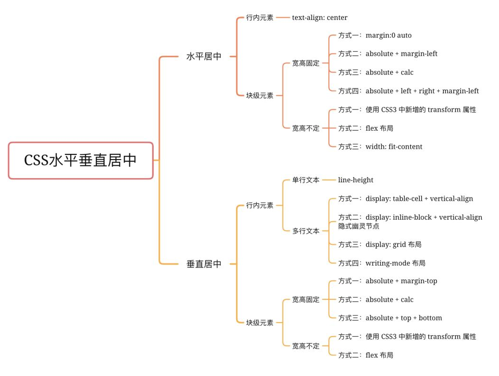

# css

- [基础知识](#基础知识)
  - [CSS3 新特性](#css3-新特性)
  - [伪类](#伪类)
  - [伪元素](#伪元素)
  - [CSS 继承元素](#css-继承元素)
  - [CSS 隐藏元素](#css-隐藏元素)
  - [position](#position)
  - [px, rem, vw](#px-rem-vw)
  - [CSS选择器优先级](#css选择器优先级)
  - [CSS 匹配顺序](#css-匹配顺序)
  - [clip-path](#clip-path)
- [布局](#布局)
  - [水平和垂直居中](#水平和垂直居中)
  - [三栏布局](#三栏布局)
  - [多种布局的优缺点](#多种布局的优缺点)
  - [九宫格布局](#九宫格布局)
- [盒模型](#盒模型)
  - [两种模型及区别](#两种模型及区别)
  - [CSS 如何设置这两种模型](#css-如何设置这两种模型)
  - [JS 如何设置获取盒模型对应的宽和高](#js-如何设置获取盒模型对应的宽和高)
  - [边距重叠](#边距重叠)
- [BFC](#bfc)
  - [清除浮动](#清除浮动)
- [IFC](#ifc)
- [Flex](#flex)
  - [Flex 布局属性](#flex-布局属性)
- [媒体查询](#媒体查询)
- [例题](#例题)
  - [1.实现一个三角形（或扇形）](#1实现一个三角形或扇形)
  - [2.消除行内元素 (inline-block) 之间的间隙](#2消除行内元素-inline-block-之间的间隙)
  - [3.文本溢出省略号](#3文本溢出省略号)

## 基础知识

### CSS3 新特性

1. CSS 实现圆角 `border-radius`， 阴影 `box-shadow`
2. 旋转，缩放，等动画: `transform: rotate(90deg)`
3. CSS 选择器，多背景， `rgba()`
4. 新增伪元素 `::selection`
5. 媒体查询 `@media`，多栏布局 `flex`

### 伪类

用于向某些选择器添加特殊效果

1. :hover 鼠标悬浮
2. :active 被激活元素
3. :focus 获得焦点元素
4. :link 未被访问链接
5. :visited 被访问过链接
6. :first-child 第一个子元素
7. :first-of-type 父元素的首个子元素
8. :nth-child 父元素的第 n 个子元素
9. :not() 非某元素的每个原生
10. :disabled 禁用状态

### 伪元素

代表某个元素的子元素，逻辑上存在，但是不存在文档树中

1. ::first-letter 文本首字母
2. ::first-line 文本首行
3. ::before 某元素之前
4. ::after 某元素之后

### CSS 继承元素

- font: font-family, font-weight, font-size
- 文本系列属性: line-height, color
- 元素可见性：visibility

### CSS 隐藏元素

1. opacity: 0
2. visibility: hidden
3. display: none
4. position: absolute; top: -9999px; left: -9999px;
5. clip-path: polygon()
6. z-index: -1

### position

1. static 默认值, 在正常文档流
2. absolute 绝对定位, 相对于 static 定位以外的第一个父元素定位
3. relative 相对定位, 相对正常位置定位
4. fixed 绝对定位, 相对浏览器窗口定位
5. inherit 从父元素继承 position 属性

### px, rem, vw

| 单位 | 含义                                                |
| ---- | --------------------------------------------------- |
| px   | 像素                                                |
| in   | 英寸, 1in = 96px                                    |
| cm   | 厘米, 1cm = 37.8px                                  |
| em   | 相对单位, 相对父元素 1em = 16px                     |
| rem  | 相对单位, 相对根元素 html                           |
| vw   | 可视区宽度, 1vw = 可视区宽度百分之一, 和 百分比相似 |

- px
  - 不能根据屏幕大小进行自适应调整
  - 有浏览器最小限制，比如浏览器自身最小字体 12 px

- rem
  - 相对单位, 不能完全匹配到设计稿
  - 需要计算, 进行单位转换
  - 混合开发中, rem 在不同尺寸屏幕上的适配与 native 界面适配不一致

### CSS选择器优先级

优先级排名：

1. `!important`
2. 行内样式
3. ID 选择器
4. 类选择器，属性选择器（例如，[type="radio"]）和伪类（例如，:hover）
5. 标签，伪元素
6. 通配符(*)
7. 继承属性
8. 浏览器默认属性

在优先级相同情况下，后面定义的 CSS 样式会被应用。

比如：

```css
#id {
  color: red;
}
.class {
  color: blue;
}
p {
  color: green;
}
```

如果匹配的都是 p 元素，那么 p 元素的颜色是 red

### CSS 匹配顺序

从右往左匹配，如果有多个选择器匹配到同一个元素，则以最后一个为准。

比如： `#div p span.span1{color:red;}`，浏览器先查找所有 class="span1" 的 span 元素，再查找其父元素为 p 元素，最后查找 p 标签的 带 id="div" 的父元素.

### clip-path

`clip-path` 属性使用裁剪方式创建元素的可视区域。可以指定一些特定形状。

## 布局

### 水平和垂直居中



水平居中:

1. text-align: center
2. margin: auto
3. 父元素 position: relative; left: 50%; 子元素 position: relative; left: 50%
4. flex 布局

垂直居中:

1. line-height = height
2. 父元素 table, 子元素 vertical-align: middle
3. flex 布局

水平垂直居中:

1. transform

    ```css
    position: absolute;
    top: 50%;
    left: 50%;
    transform: translate(-50%, -50%);
    ```

### 三栏布局

1.假设高度已知，请写出三栏布局，其中左栏、右栏宽度各为 300 px, 中间自适应

(1) 浮动

```css
.float .left {
  float: left;
  width: 300px;
}
.float .right {
  float: right;
  width: 300px;
}
.float .center {
  backgroud: red;
}
```

(2) 绝对定位

```css
.absolute .left {
  position: absolute;
  width: 300px;
  top: 0;
  left: 0;
}
.absolute .center {
  position: absolute;
  left: 300px;
  right: 300px;
  backgroud: yellow;
}
.absolute .right {
  position: absolute;
  width: 300px;
  top: 0;
  right: 0;
}
```

(3) flexbox 弹性布局

```css
.flexbox {
  display: flex;
}
.flexbox .left {
  width: 300px;
}
.flexbox .center {
  flex: 1
}
.flexbox .right {
  width: 300px;
}
```

(4) table 表格布局

```css
.tablebox {
  display: table;
  width: 100%;
  height: 200px;
}
.tablebox .left {
  display: table-cell;
  width: 300px;
}
.tablebox .center {
  display: table-cell;
  backgroud: blue;
}
.tablebox .right {
  display: table-cell;
  width: 300px;
}
```

(5) grid 网格布局

```css
.gridbox {
  display: grid;
  width: 100%;
  grid-template-rows: 200px;
  grid-template-columns: 300px auto 300px;
}
.grid .left {
  background: #000;
}
.grid .left {
  background: #ddd;
}
.grid .right {
  background: #0ff;
}
```

### 多种布局的优缺点

一、float 布局

使用 float 可以使元素脱离文档流，形成 BFC，在重新渲染时不会影响其他的元素。需要注意使用 `float` 的元素其父元素会塌陷，需要清除浮动。

二、flex 弹性布局

flex布局主要适用于移动端项目

三、table 布局

1. Table 要比其它 html 标记占更多的字节。(延迟下载时间，占用服务器更多的流量资源。)
2. Table 会阻挡浏览器渲染引擎的渲染顺序。

四、grid 布局

规范并未成熟，主流的浏览器使用较少，不推荐使用在企业项目中

### 九宫格布局

一、Flex

设置父元素

```css
.ul {
  display: flex;
  width: 100px;
  height: 180px;
  flex-wrap: wrap;
  align-content: start; // 子元素换行，多行设置
}
li {
  width: 30%;
  height: 30%;
  margin-right: 5%;
  margin-bottom: 5%;
}

li:nth-of-type(3n) {
  margin-right: 0; // 3的倍数的元素, 3, 6, 9 等
}

li:nth-of-type(n+7) {
  margin-bottom: 0; // 等于大于 7 的元素, 7, 8, 9
}
```

二、Float

子元素

```css
.li {
  float: left;
  width: 30%;
  height: 30%;
  margin-right: 5%;
  margin-bottom: 5%;
}
```

## 盒模型

基本概念

content, padding, border, margin

### 两种模型及区别

默认值，标准盒子模型
width = content

怪异模型，IE 盒模型
width = content + padding + border

### CSS 如何设置这两种模型

box-sizing: content-box;

box-sizing: border-box;

### JS 如何设置获取盒模型对应的宽和高

设置 dom 元素的宽高样式 一般有三种方法：

1. 内联样式
2. style 标签
3. 通过 link 标签引入(外联样式)

获取 dom 元素宽高样式，有下列 4 种方法：
一

```js
dom.style.width/height

// 只能获取 1， 即内联样式
```

二

```js
dom.currentStyle.width/height

// 获取1, 2, 3渲染后的宽高，但是仅 IE 支持
```

三

```js
window.getComputedStyle(dom).width/height

// 与2原理相似，但是兼容性好一些
```

四

```js
dom.getBoundingClientRect().widht/height

// 计算元素绝对位置（相对于视窗左上角），
// 获取到四个元素left, top, width, height
```

### 边距重叠

1.父子元素边距重叠

```html
<div class="parent">
  <div class="child"></div>
</div>
```

```css
.child {
  width: 100%;
  height: 100px;
  margin-top: 10px;
}

// 父级元素 parent 高度多少？
// 100
```

解决方案：父元素设置 padding，或者 border，或者触发 BFC

## BFC

1.基本概念

英文名, block formatting context, 块级格式化上下文.
它是一个独立的渲染区域, 里面由块级元素组成.
MDN: 是块盒子的布局过程发生的区域, 也是浮动元素与其他元素交互的区域.
文档的根元素 HTML 就是 BFC 元素.

2.BFC的原理(渲染规则)

- (1) BFC 的元素中, 在垂直方向上的margin会发生重叠(根元素`<html>`就是一个 BFC 元素)
- (2) BFC 区域不会和 float 元素重叠(两栏自适应)
- (3) BFC 元素在页面上是一个独立的容器, 外面的元素和里面的元素互不影响
- (4) 计算 BFC 元素的高度时,里面浮动元素的高度也会参与计算(`overflow:hidden`可以清除浮动)

3.如何创建 BFC

- (1) float 布局，float right，left
- (2) position 为 absolute, fixed
- (3) overflow 为 hidden
- (4) display 为 inline-block, table, table-cell, table-caption

4.BFC 使用场景

(1) 防止 margin 重叠(塌陷)  
(2) 清除浮动
(3) 自适应多栏布局的
(4) 浮动元素周围文字环绕

### 清除浮动

1. clear: both
2. overflow: hidden, overflow: auto
3. :after clear:both, content: ""

## IFC

`Inline Formatting Context`，行内格式化上下文。

创建一个 IFC: 块级元素中仅包含内联级别元素；设置其为 `inline-block` 则会在外层产生 IFC. 各行内框（inline boxes）一个接一个地排列，其排列顺序根据书写模式（writing-mode）的设置来决定，
有水平模式，垂直模式。

作用: 解决元素垂直居中

布局规则

1. 子元素水平方向横向排列，并且垂直方向起点为元素顶部
2. 子元素只会计算横向样式空间，【 padding、border、margin 】，垂直方向样式空间不会被计算，【 padding、border、margin 】
3. 在垂直方向上，子元素会以不同形式来对齐（vertical-align）
4. float 元素优先排列

## Flex

通常称为 flexbox 或 flex，也称为弹性盒子或弹性布局

flex 有两根轴线，分别是主轴(`main axis`：项目排列布局的方向，默认是水平方向 `row`)和交叉轴，主轴的方向由 `flex-direction` 属性控制，交叉轴始终垂直于主轴

### Flex 布局属性

1. `flex-wrap: nowrap | wrap | wrap-reverse;`  
  用于指定项目太多超过一行的时候是否换行，默认 `nowrap` 不换行
2. `flex-direction`: row | row-reverse | column | column-reverse;  
3. `flex-flow`  
  是 flex-direction 和 flex-wrap 的合并简写
4. `flew-grow`  
  让项目放大。默认 0 不放大
5. `flex-shrink`
  缩小程度。但不是按比例缩小。默认1，同比例收缩
6. `flex-basis`  
  项目占据尺寸。默认 auto，自动计算
7. `flex`  
  是 flex-grow flex-shrink flex-basis 合并简写。默认值：`flex: 0 1 auto`  

布局属性

1. `justify-content`

    ```css
    justify-content: center; /* 居中排列 */
    justify-content: space-between; /* 均匀排列每个元素
                                   首个元素放置于起点，末尾元素放置于终点 */
    justify-content: space-around; /* 均匀排列每个元素
                                      每个元素周围分配相同的空间 */
    ```

2. `align-item` 和 `align-content` 区别
   align-items 是针对每一个子项起作用居中，`align-content` 用于多行。

## 媒体查询

```css
/* 在小于或等于 992px 的屏幕里 */
@media screen and (max-width:992px) {
  body {}
}
```

## 例题

### 1.实现一个三角形（或扇形）

- 利用 border
  - 高度，宽度为 0
- 利用 CSS3 的 clip-path 属性
  - 使用裁剪方式创建元素的可显示区域。
  - 区域内的部分显示，区域外的隐藏。
  - polygon（多边形）根据点的坐标绘制一条闭合的遮罩区域
- rotate 和 overflow: hidden
- linear-gradient 渐变色

```css
.triangle1 {
  width: 0;
  height: 0;
  border: 10px solid transparent;
  border-top-color: black;
  /* 只有上边框有颜色，其它为透明 */
  /* 本质上占用的空间还是一个正方形 */
  /* 不设置 border-bottom 即可 */

  /* border-top: 10px solid black;
  border-right: 10px solid transparent;
  border-left: 10px solid transparent; */
}

.triangle2 {
  clip-path: polygon(50% 0, 0% 100%, 100% 100%);
  height: 10px;
  width: 15px;
  background-color: #fff;
}
```

扇形

- `border-radius` 和 `border-width` 相同, 100%
- 尖头朝上的扇形

```css
.sector {
  width: 0;
  height: 0;
  border-width: 20px;
  border-style: solid;
  border-color: transparent transparent green;
  border-radius: 20px;
}
```

### 2.消除行内元素 (inline-block) 之间的间隙

消除字符间距

1. 父元素：`font-size: 0`
2. 父元素：`display: flex;`
3. 子元素浮动：`float: left;`

```html
<div class="parent">
  <div class="child">child1</div>
  <div class="child">child2</div>
</div>
```

```css
.parent .child {
  display: inline-block;
  background-color: #fdfd04;
  width: 100px;
  height: 100px;
}

```

### 3.文本溢出省略号

一、单行

```css
overflow: hidden;（文字长度超出限定宽度，则隐藏超出的内容）
white-space: nowrap;（设置文字在一行显示，不能换行）
text-overflow: ellipsis;
```

二、多行

```css
display: -webkit-box;
line-clamp: 2;
-webkit-line-clamp: 2;
text-overflow: ellipsis;
```
