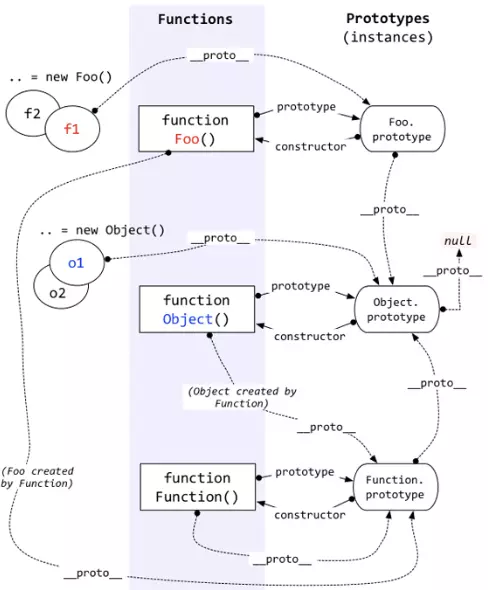

# 继承

JavaScript 本身不提供 `class` 实现( es6 提供了语法糖)，想要继承得基于原型 `prototype`。

- [相关概念](#相关概念)
  - [原型及原型链](#原型及原型链)
  - [constructor](#constructor)
  - [new](#new)
  - [instanceof](#instanceof)
- [继承方式](#继承方式)
  - [原型链继承](#原型链继承)
  - [构造函数继承](#构造函数继承)
  - [组合继承](#组合继承)
  - [原型式继承](#原型式继承)
  - [寄生继承](#寄生继承)
  - [寄生组合式继承](#寄生组合式继承)
  - [ES6 extends](#es6-extends)
- [问题](#问题)
  - [子类不调用 super()](#子类不调用-super)

继承都基于两种方式：

- 原型链，即子类的原型指向父类的实例从而实现原型共享。
- 构造函数，即通过 js 的 `apply`, `call` 实现子类调用父类的属性、方法；

## 相关概念

### 原型及原型链

原型：

隐式原型 `__proto__`

- 每个对象（基础类型也有，`null` 除外）都有 `__proto__` 属性，指向创建该对象的函数的原型(`prototype`)。
- 使用场景: 原型链的实现。
- 非标准实现，ES6 引入了 `Object.getPrototypeOf()` 方法，用于读取对象的隐式原型。

显示原型 `prototype`

- 和 `__proto__` 相同，但是 `prototype` 属性是函数才有的。
- 使用场景: 用于构造函数的实例共享属性和方法。

原型链：

当访问当前对象的属性或者方法时，如果它本身找不到，就会去它`__proto__` 指向的对象的原型去寻找，直到到达原型链的终点 `null` 停止。这个过程称为原型链。



### constructor

1. 用于返回创建该对象的函数

   ```js
   var obj = []
   obj.constructor // Array
   ```

2. 在一个 Class 类中只能有一个 `constructor` 方法, 用于创建和初始化 class 创建的对象的特殊方法

    ```js
    class Polygon{
      constructor() {
        this.name = 'Polygon'
      }
    }
    const poly1 = new Polygon()
    ```

### new

new 关键字所形成的原型链关系是：`实例.__proto__` === `构造函数.prototype`

[手写 new](./new.js)

### instanceof

`a instanceof Fn`: 沿着 `a.__proto__` 往上找, 同时沿着 `B.prototype` 找, 如果找到同一个引用, 即返回 true

[instanceof](./instanceof.js)

```js
function myInstanceof(target, origin) {
  if (target === null) return false

  while (!!target) {
    if (target.__proto__ === origin.prototype) {
      return true
    }
    target = target.__proto__
  }
  return false
}
```

## 继承方式

[原型链继承](#原型链继承)  
[构造函数继承](#构造函数继承)  
[组合继承](#组合继承)  
[原型式继承](#原型式继承)  
[寄生继承](#寄生继承)  
[寄生组合式继承](#寄生组合式继承)  
[ES6 extends](#es6-extends)  

### 原型链继承

要点：将父类实例作为子类的原型

```js
Sub.prototype = new Super()
Sub.prototype.constructor = Sub
```

优点：

- 简单、易懂
- 父类方法可以复用

缺点：

- 不能传参
- 父子构造函数的原型对象之间有共享问题

### 构造函数继承

要点：改变父类构造函数的 `this` 指向

```js
function Child(age) {
  Parent.call(this, age)
  // Parent.apply(this, arguments)
}
```

优点：

- 简单，不存在共享问题
- 可以传参

缺点：

- 没有继承原型链上的方法

### 组合继承

要点：原型链 + 构造函数

```js
function Child(age) {
  Parent.call(this, age)
}
Child.prototype = new Parent()
Child.prototype.constructor = Child
```

优点：

- 解决了构造继承和原型链继承的缺点
- 父类的方法可以被复用
- 可以传参

缺点：

- 父类的构造函数被执行了两次
- 子类实例的属性存在两份。造成内存浪费

### 原型式继承

要点：借用 中间对象 实现原型继承，本质是对象的浅复制(`Object.create()`)

subObj 拥有了对象 o 的全部属性（在原型链上），而修改 subObj 的属性，不会影响到 o，相当于把 o 复制了一份。

```js
function createObject(o){
    function F(){}
    F.prototype = o
    const subObj = new F()
    return subObj
}
const Child = createObject(Parent)
```

优点：

- 父类方法可以复用

缺点：

- 不能传参
- 子类原型共享问题

### 寄生继承

组合继承，问题是实现的时候调用了两次超类（父类）。寄生继承就是不用实例化父类了，直接实例化一个临时副本实现了相同的原型链继承。（即子类的原型指向父类副本的实例从而实现原型共享）

要点：封装原型式继承，创建一个封装继承过程的函数

```js
function createObject(o){
    function F(){}
    F.prototype = o;
    return new F();
}
function inherit(o) {
  let clone = createObject(o)
  clone.say = function() {
    // ...
  }
  return clone
}
```

优点：

- 扩展父类方法

缺点：

- 不能传参
- 子类原型共享问题

### 寄生组合式继承

要点：寄生继承 + 组合继承

原型链方式可以实现 属性方法共享，但无法做到属性、方法独享（例如 Sub1 修改了父类的函数，其他所有的子类 Sub2、Sub3 调用的旧方法失效）；

构造函数除了能 独享属性、方法外还能在子类构造函数中传递参数，但代码无法复用。总体而言就是可以实现所有属性方法独享，但无法做到属性、方法共享（例如，Sub1新增了一个函数，然后想让 Sub2、Sub3...都可以用的话就无法实现了，只能Sub2、Sub3...各自在构造函数中新增）。

```js
// 1
function Child(age) {
  Parent.call(this, age)
  this.name = name
}
(function () {
  let F = function () {}
  F.prototype = Parent.prototype
  Child.prototype = new F()
  Child.prototype.constructor = Child
})()

// 2
function createObject(o){
    function F(){}
    F.prototype = o;
    return new F();
}
function inherit(child, parent) {
  let prototype = createObject(parent.prototype)
  prototype.constructor = child
  child.prototype = prototype
}
function Child(age) {
  Parent.call(this, age)
}
inherit(Child, Parent)


// 3
function Child(age) {
  Parent.call(this, age)
}
Child.prototype = Object.create(Parent.prototype)
Child.prototype.constructor = Child
```

优点：

- 解决了组合继承唯一缺点：不用调用两次父类

缺点：

- 较为复杂

### ES6 extends

要点：class 语法糖, super

```js
class Child extends Parent {
  constructor(name, age) {
    super(name);
    this.age = age;
  }
}
```

优点：

- 简单，易懂

缺点：

- 依赖 js 适配版本

## 问题

### 子类不调用 super()

必须 显式的调用 super(), 不调用代码执行会报错

```js
class Animal {
  constructor(name) {
    this.name = name;
  }
  
  eat() {
    console.log(`${this.name} is eating`);
  }
}

class Cat extends Animal {
  constructor(name, color) {
    // 没有调用 super()
    this.color = color;
  }
  
  meow() {
    console.log(`${this.name} is meowing`);
  }
}

let cat = new Cat('Kitty', 'white'); 

// 报错
// ReferenceError: Must call super constructor in derived class before accessing 'this' or returning from derived constructor
```
