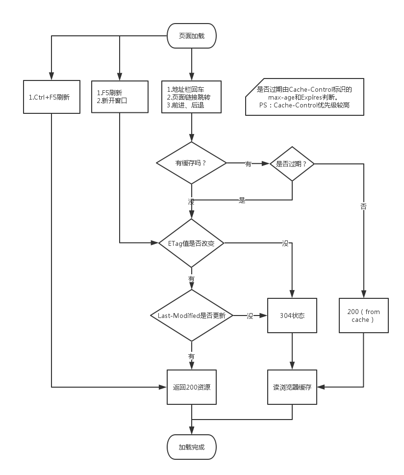

# 网络通信

- [五层网络模型](#五层网络模型)
- [同源策略及限制](#同源策略及限制)
- [前后端通信方式](#前后端通信方式)
- [鉴权方式](#鉴权方式)
- [Ajax](#ajax)
- [跨域](#跨域)
  - [跨域通信的方式](#跨域通信的方式)
  - [CORS 跨域原理](#cors-跨域原理)
  - [为什么会发送 options 请求](#为什么会发送-options-请求)
- [REST](#rest)
- [TCP/IP](#tcpip)
  - [TCP 的三次握手和四次挥手](#tcp-的三次握手和四次挥手)
- [UDP](#udp)
- [HTTP](#http)
  - [HTTP 消息](#http-消息)
  - [HTTP 状态码](#http-状态码)
  - [HTTP 优化](#http-优化)
  - [HTTP1.0 与 HTTP1.1](#http10-与-http11)
  - [HTTP2](#http2)
  - [HTTP3.0](#http30)
- [SSL/TLS/HTTPS](#ssltlshttps)
  - [HTTPS](#https)
  - [HTTPS 建立连接](#https-建立连接)
- [HTTP 中 GET 和 POST 有什么区别？](#http-中-get-和-post-有什么区别)
- [缓存](#缓存)
  - [浏览器缓存](#浏览器缓存)
    - [Service Worker](#service-worker)
    - [强缓存](#强缓存)
    - [协商缓存](#协商缓存)
    - [浏览器缓存顺序](#浏览器缓存顺序)
  - [本地缓存](#本地缓存)
    - [cookie](#cookie)
    - [session](#session)
    - [localStorage](#localstorage)
    - [sessionStorage](#sessionstorage)
    - [本地缓存对比](#本地缓存对比)
  - [数据库缓存](#数据库缓存)
  - [代理服务器缓存](#代理服务器缓存)
  - [CDN 缓存](#cdn-缓存)
- [网络安全](#网络安全)
  - [XSS 跨站脚本攻击](#xss-跨站脚本攻击)
    - [XSS 攻击方式](#xss-攻击方式)
    - [XSS 防范措施](#xss-防范措施)
  - [CSRF 跨站请求伪造](#csrf-跨站请求伪造)
    - [CSRF 攻击方式](#csrf-攻击方式)
    - [CSRF 防御措施](#csrf-防御措施)
  - [XSS 和 CSRF 区别](#xss-和-csrf-区别)
- [文件上传下载](#文件上传下载)
- [分片传输](#分片传输)
- [网络性能优化](#网络性能优化)

## 五层网络模型

<!-- TODO: -->

## 同源策略及限制

同源策略限制从一个源加载的文档或脚本如何与来自另一个源的资源进行交互。

这是一个用于隔离潜在恶意文件的关键的安全机制。

源：协议、域名、端口。
默认端口：80

不同源之间的限制，比如：
Cookie、LocalStorage 和 IndexDB 无法读取
DOM 无法获取
AJAX 无法发送

## 前后端通信方式

1. Ajax
  同源下的通信

2. WebSocket
  不限制

3. CORS
  支持不同源通信

## 鉴权方式

[用户鉴权方式](./authentication.md)

## Ajax

创建 Ajax

```js
let request = new XMLHttpRequest
// IE 
// new ActiveXObject('Microsoft.XMLHTTP')
request.open('GET', url, true)
request.onreadystatechange = function() {
  if(request.readyState === 4 && request.status === 200) {
    // ...
  }
}
request.send()
```

## 跨域

两个不同源的页面进行 http 请求，浏览器就会显示跨域。

- 浏览器同源策略
- 不会限制 `<link>，, <script>, <iframe>` 加载第三方资源

### 跨域通信的方式

1. JSONP

2. Hash

3. postMessage

4. WebSocket

5. CORS

一、 JSONP

原理: 利用 `script` 不会被浏览器限制跨域请求，读取文件，
在本地创建一个 `script` 标签，然后加载。

```js
// 主网页
function handleCallback(result) {
    console.log(result.message);
}

var jsonp = document.createElement('script');
var ele = document.getElementById('demo');
jsonp.type = 'text/javascript';
jsonp.src = 'http://localhost:8080?callback=handleCallback';
ele.appendChild(jsonp);
ele.removeChild(jsonp);

// http://localhost:8080
// 返回 'handleCallback({error:0, message: { 数据内容}})'
```

二、 Hash

页面 A 通过iframe或frame嵌入了跨域的页面 B

```js
// 在A中伪代码如下：
var B = document.getElementsByTagName('iframe');
B.src = B.src + '#' + 'data';

// 在B中的伪代码如下
window.onhashchange = function () {
  var data = window.location.hash;
};
```

三、 postMessage

窗口A(http:A.com)向跨域的窗口B(http:B.com)发送信息

```js
A
window.postMessage('data', 'http://B.com');
```

// 在窗口 B 中监听

```js
B
window.addEventListener('message', function (event) {
    console.log(event.origin);
    console.log(event.source);
    console.log(event.data);
}, false);
```

四、 WebSocket

```js
var ws = new WebSocket('wss://echo.websocket.org');

ws.onopen = function (evt) {
    console.log('Connection open ...');
    ws.send('Hello WebSockets!');
};

ws.onmessage = function (evt) {
    console.log('Received Message: ', evt.data);
    ws.close();
};

ws.onclose = function (evt) {
    console.log('Connection closed.');
};
```

五、CORS

全称是"跨域资源共享"(Cross Origin Resource Sharing)
可以理解为支持 跨域 的 ajax

```js
fetch('/some/url/', {
    method: 'get',
}).then(function (response) {

}).catch(function (err) {
  // 出错了，等价于 then 的第二个参数，但这样更好用更直观
});
```

比如 vue 和 react 中的 axios

### CORS 跨域原理

浏览器一旦发现 AJAX 请求跨源，就会自动添加一些附加的头信息，有时还会多出一次附加的请求，但用户不会有感觉。
因此，实现 CORS 通信的关键是服务器。
只要服务器实现了 CORS 接口，就可以跨源通信。

### 为什么会发送 options 请求

浏览器行为，有时候发生，有时候不发生.

options 请求，跨域请求之前的预检查。options 请求头会返回 `Access-Control-Allow-Methods` 即支持请求的方法。

## REST

表现层状态转移(Resource Representational State Transfer)

描述的是在网络中client和server的一种交互形式，帮助设计 RESTful API。

“古代”网页是前后端不分离的，比如 PHP、JSP 等，后面前后端分离，加上出现了 IOS 和 Android，就需要一套统一的提供服务的接口，RESTful 就是更好的选择。

比如：

- URI 使用名词而不是动词，看 URL 就知道要什么
- 用 HTTP 方法描述操作；GET 获取，POST 创建，PUT 更新，DELETE 删除等
- 保证 HEAD 和 GET 安全，不会改变资源状态（污染）
- 用 HTTP Status Code 传递 Server 的状态信息；
  - 200 Success
  - 500 Server Error
- 请求体使用 json 格式

## TCP/IP

TCP: Transmission Control Protocl 传输控制协议

| 协议            | 层级       |
| --------------- | ---------- |
| HTTP、SMTP、DNS | 应用层     |
| TCP、UDP        | 传输层     |
| IP、ICMP        | 网络层     |
| 网络接口        | 网络接口层 |

### TCP 的三次握手和四次挥手

三次握手目的: **双方确认自己与对方的发送与接收是正常的**

- 客户端–发送带有 SYN 标志的数据包–服务端
- 服务端–发送带有 SYN/ACK 标志的数据包–客户端
- 客户端–发送带有带有 ACK 标志的数据包–服务端

四次挥手目的: **FIN 表示不再发送数据, ACK 表明不再接收数据。直接 Close，服务端未必把全部数据都发送出来了。**

- 客户端 发送一个 FIN，用来关闭 客户端 到 服务端 的数据传送，客户端 进入 FIN_WAIT_1 状态
- 服务端 收到 FIN 后，发送一个 ACK 给 客户端，确认收到
- 服务端 发送一个 FIN，用来关闭 服务端 到 客户端 的数据传送
- 客户端 收到 FIN 后，客户端进入 TIME_WAIT 状态，接着发送一个 ACK 给 服务端，确认收到

注释:

- SYN (Synchronize Sequence Numbers): 同步序列编号
- ACK (Acknowledge character): 确认字符
- FIN (Finish): 停止发送数据

## UDP

User Datagram Protocol 用户数据报协议

UDP 没有拥塞机制，因此网络出现拥堵不会使源主机的发送效率降低。有利于实时会议视频等

## HTTP

HTTP：HyperText Transfer Protocol 超文本传输链接

HTTP 特性: 无状态，持久连接

### HTTP 消息

两种消息类型：请求(request)，响应(response)

HTTP 请求报文分为三部分：请求行、请求头、请求体

e.g.

```text
　　POST/GET http://download.microtool.de:80/somedata.exe 
　　Host: download.microtool.de 
　　Accept:*/* 
　　Pragma: no-cache 
　　Cache-Control: no-cache 
　　Referer: http://download.microtool.de/ 
　　User-Agent:Mozilla/4.04[en](Win95;I;Nav) 
　　Range:bytes=554554- 
```

请求行：请求方法(method) 请求地址(path) 协议格式

请求头：

- Accept: value
- Authorization: value2
- User-Agent: Mozilla/5.0
- Cache-Control: no-cache

请求体 body

请求方法:

- GET
- POST
- PUT
- DELETE
- PATCH
- HEAD
- OPTIONS
- CONNECT
- TRACE

响应报文

响应头：

- Cache-Control: 缓存机制类型
- Content-Length: 响应体长度
- Content-Type: 返回内容的 MIME 类型
- Expires：响应过期日期和时间
- Last-Modified
- Set-Cookie：设置 Http Cookie

### HTTP 状态码

响应分为五类：

- 100-199：信息响应
- 200-299：成功响应
- 300-399：重定向
- 400-499：客户端错误
- 500-599：服务端错误

| 状态码 | 含义                                                        |
| ------ | ----------------------------------------------------------- |
| 100    | Continue                                                    |
| 101    | 切换协议                                                    |
| 200    | OK 请求成功                                                 |
| 206    | 返回一部分资源                                              |
| 301    | 永久重定向                                                  |
| 302    | Found  临时重定, 继续向原有地址发送以后的请求向             |
| 303    | See Other 重定向到一个新的资源                              |
| 304    | Not Modified 内容未变化，客户端访问缓存资源，和协商缓存有关 |
| 400    | Bad Request 参数有错                                        |
| 401    | Unauthorized 未验证                                         |
| 403    | Forbidden 禁止访问                                          |
| 404    | Not Found 未找到资源                                        |
| 405    | Method Not Allowed 请求方法不对                                        |
| 500    | Internal Server Error 服务器错误                            |
| 502    | Bad Gateway                                                 |
| 504    | Gateway Time-out 请求超时                                   |

### HTTP 优化

主要两个因素：带宽和延迟

- 带宽
- 延迟
  - **浏览器阻塞**：浏览器对同一个域名，同时只能有 4 个连接(根据浏览器内核不同有所差异)，超出最大连接限制，后续请求就会阻断
  - **DNS 查询**: 利用 DNS 缓存
  - **建立连接**: HTTP 是基于 TCP 的，最快也要在第三次握手是携带 HTTP 请求报文。

之前如何克服延迟:

- Spriting 雪碧图，这样多个请求变为一个
- 拼接 js, 把多个js 合并为一个大文件
- 分片，（把 资源分散到多个服务器上，走不同的域名）

### HTTP1.0 与 HTTP1.1

1. **缓存处理**
   - HTTP1.0 为 If-Modified-Since, Expires
   - HTTP1.1 添加了 Etag，If-Unmodified-Since, If-Match, If-None-Match

2. **带宽优化及网络连接的使用**
   - HTTP1.0 返回整个资源，不支持断点续传功能
   - HTTP1.1 允许只请求资源的某个部分，即返回码是 206

3. Host 头处理
4. 长连接
   - HTTP1.1 支持长连接，默认开启 `Connection: keep-alive`，一个 TCP 连接上可以传送多个 HTTP 请求和响应

### HTTP2

HTTP2 不再使用小版本号，新协议是 HTTP2。

1. 二进制分帧
   - 之前是文本协议，二进制协议更高效，错误更少
2. 首部压缩
3. 多路复用
4. 请求优先级
5. 服务器推送

HTTP2.0 性能加强的核心在于 二进制 传输，在 HTTP1.x 中通过文本的方式传输。

### HTTP3.0

HTTP3.0 放弃 TCP 协议，采用 UDP + 迪菲赫尔曼算法，实现 QUIC 协议。

TCP 缺点：

1. TCP 传输是一个一个按顺序，的数据包，接收也是按顺序。如果某个数据包没有按顺序，会发生队头阻塞，阻塞后续请求。
2. TCP 三次握手需要消耗时长。TCP三次握手的过程客户端和服务器之间需要交互三次，那么也就是说需要额外消耗1.5 RTT（网络延迟 Round Trip Time）。

UDP ：不可靠传输协议，但是 QUIC 在UDP的基础上做了些改造，使得他提供了和 TCP 类似的可靠性。

## SSL/TLS/HTTPS

SSL/TLS是一种密码通信框架，他是世界上使用最广泛的密码通信方法。

安全套接层（Secure Sockets Layer，缩写：SSL）是一种安全协议，目的是为互联网通信，提供安全及数据完整性保障。

传输层安全协议（英语：Transport Layer Security，缩写：TLS），是 IETF 在 SSL3.0 基础上设计的协议，实际上相当于SSL的后续版本。

### HTTPS

HTTPS 协议是由 `SSL+HTTP` 协议构建的可进行加密传输、身份认证的网络协议

1. HTTPS 协议需要到 CA 申请证书，一般免费证书很少，需要交费。
2. HTTP 协议运行在 TCP 之上，所有传输的内容都是明文，HTTPS 运行在 SSL/TLS 之上，SSL/TLS 运行在 TCP 之上，所有传输的内容都经过加密的。
3. HTTP 端口 80 和 HTTPS 端口 443。
4. HTTPS 可以有效的防止运营商劫持，解决了防劫持的一个大问题。

例题：

一、路由器抓包 https 可以看到路由地址吗？

可以的，https = ssl + http。比如电脑和手机联调，使用 fiddler ，安装证书就可以看到。或者把请求拦截来，把 ssl 协议剥离，变成 http 协议，也可以看到来。

### HTTPS 建立连接

1. TCP 的三次握手
2. 客户端 向 服务器索要验证的公钥
3. 双方协商产生 会话密钥
4. SSL 加密协商完成
5. 双方采用 会话密钥 进行加密通信

## HTTP 中 GET 和 POST 有什么区别？

GET 和 POST 本质上就是 TCP 链接，区别是在 HTTP 规定和 浏览器和服务器处理中

由于 HTTP 协议并没有限制 GET 一定没有 Body, POST 一定不能把参数放 URL 的 queryString 上。

这样太自由了，而且后端接口需要对接前端，IOS，Android 端等，所以需要一些特定的接口风格和规范。

最火的就是 REST，REST 约定了GET 是获取，POST 是创建。

在 HTTP 协议中的语义也不同：

- GET: 获取资源
- POST: 创建/更新资源

一、**浏览器端**

- GET
  - 因为是读取资源，所以资源可以缓存，URL 可保存书签
  - 发送请求没有 Body (但是在 RESTful API, 参数可以放 Body 里，要看后端怎么处理)
  - 参数在 URL，因为 URL 变化才能触发浏览器主动发送 GET
  - 可以回退
  - URL 长度限制，浏览器做的
  - 发一个请求
- POST
  - 不能保存书签，不然一打开书签就发送 POST 创建/修改资源请求。比如页面有表单，  
    刷新浏览器会出现一个提示弹窗，询问 “确认重新提交表单”
  - 参数也能放 URL
  - 不可以回退
  - 有些浏览器发两个请求，先发 header，响应 100-continue 再发 body 数据(Firefox 火狐浏览器就发送一次请求)

二、**安全性**

GET

- URL 传输，更容易看到

POST

- 用 Body 传输，相对更安全

但是 HTTP 是明文协议，每个 HTTP 请求都会在网络上明文传播，不管是 URL 还是 Body。

如果要避免数据被窃取，就要使用 HTTPS，从客户端到服务器端对端加密。

## 缓存

缓存从微观上可以分为以下几类：

- 浏览器缓存（http缓存）
- 代理服务器缓存
- CDN 缓存
- 数据库缓存
- 应用层缓存（本地缓存）

### 浏览器缓存

也叫 `http` 缓存

Web 缓存的好处：

- 减小网络延迟，加快页面打开速度；从缓存请求内容比从源服务器所用时间更少，缓存的使用可以明显加快页面打开速度。
- 下降服务器的压力；给网络资源设定有效期以后，用户能够重复使用浏览器的缓存，减小对源服务器的请求，间接下降服务器的压力。
- 减小网络带宽损耗；对于网站运营者或者用户，带宽都表明着金钱。当缓存副本被使用时，会产生更小的网络流量，下降运营成本。

缓存的位置 Service Worker, Memory Cache, Disk Cache, Push Cache

#### Service Worker

用于浏览器缓存资源

Service Worker 运行在浏览器的独立线程可以实现浏览器的缓存功能，传输协议需要使用 HTTPS。

如果网站中注册了 Service Worker 那么它可以拦截当前网站所有的请求，进行判断（需要编写相应的判断程序），如果需要向服务器发起请求的就转给服务器，如果可以直接使用缓存的就直接返回缓存不再转给服务器。提高浏览体验。

- 基于 web worker（一个独立于 JavaScript 主线程的独立线程，在里面执行需要消耗大量资源的操作不会堵塞主线程）
- 在 web worker 的基础上增加了离线缓存的能力
- 本质上充当 Web 应用程序（服务器）与浏览器之间的代理服务器（可以拦截全站的请求，并作出相应的动作->由开发者指定的动作）
- 由事件驱动的,具有生命周期
- 支持推送
- 可以让开发者自己控制管理缓存的内容以及版本

sw 工作原理：  
1、后台线程：独立于当前网页线程；
2、网络代理：在网页发起请求时代理，来缓存文件；

**注意：**

- Service Worker 运行在 worker 上下文 --> 不能访问 DOM
- 它设计为完全异步，同步API（如 XHR 和 localStorage）不能在 Service Worker 中使用
- 只能使用 HTTPS

#### 强缓存

强缓存是我们没有发送 HTTP 请求，而是直接从本地缓存中获取资源的一种行为。成功后返回状态码 200。

`Expires`

http1.0 中一个页面的缓存字段。这个时间是浏览器强缓存资源失效的时间

```js
Expires: Wed, 22 Nov 2021 08:41:00 GMT
```

- 绝对时间，修改本地客户端，会导致误判
- 在 HTTP1.1 时 `Expires` 被放弃了

`Cache-Control`

HTTP1.1 中页面的缓存字段。 如果 `Expires` 和 `Cache-Control` 都存在，那么 `Cache-Control` 的优先级更高。

```js
Cache-Control: max-age = 3600
// 表示距离上次请求的一小时内可以直接使用本地的缓存，不需要再次请求。
```

- `max-age` 相对时间
- `public` 表示可以被浏览器或代理服务器缓存
- `private` 表示只能被浏览器缓存
- `no-cache` 需要发送请求到服务器确认是否被缓存，这需要使用到协商缓存
- `no-store` 表示禁止使用缓存，每一次都需要请求服务器

如果你不希望重复使用响应，而是希望始终从服务器获取最新内容，则可以使用 `no-cache` 指令强制验证。

`no-cache` 指令不会阻止响应的存储，而是阻止在没有重新验证的情况下重用响应。

`no-store` 指令阻止存储响应，但不会删除相同 URL 的任何已存储响应。不建议随意授予 `no-store`，因为你失去了 `HTTP` 和浏览器所拥有的许多优势，包括浏览器的后退/前进缓存。

#### 协商缓存

浏览器携带 缓存的标识 `tag` 向服务器发送请求，服务器更具携带过来的标识判断是否使用缓存的这个过程就是 协商缓存。 浏览器请求服务器返回的结果有两种，

- 一种返回 304 表示服务器的资源还没有更新直接使用浏览器本地的缓存即可。
- 另一种返回 200，表示服务器资源更新且携带新的资源返回给浏览器。

`Etag / If-None-Match`

```js
etag: W/"5357d2b3f63545926812b95658505315"
```

`Etag` 时服务器响应请求时 返回的一个唯一标识。这个标识只能由服务器产生。etag 值没有规定，可以是时间戳的哈希值，版本号等

`If-None-Match` 时浏览器再次请求服务器时，会携带 Etag 标识值发送给服务器，服务器会将这个值和在服务器中的Etag比较，两个值相等那么返回 304，如果不相等就返回 200 将新的资源返回。

```js
GET /index.html HTTP/1.1
Host: example.com
Accept: text/html
If-None-Match: "deadbeef"
```

如果服务器为请求的资源确定的 ETag 标头的值与请求中的 If-None-Match 值相同，则服务器将返回 304 Not Modified。

`Last-Modified/If-Modified-Since`

```js
Last-Modified: Wed, 23 Nov 2021 08:41:00 GMT
```

Last-Modified，指的是返回请求的资源文件最后在服务器被修改的时间。

If-Modified-Since，是浏览器再次请求资源时，会携带上一次返回的 Last-Modified 的时间发送给服务器。服务器将上一次最后修改的时间 和现在的最后修改的时间做对比。如果大于 If-Modified-Since 的值，服务器就会返回新的资源 200，否则返回 304。

缺点：时间格式复杂且难以解析，分布式服务器难以同步文件更新时间。

#### 浏览器缓存顺序

1. Service Worker（不会自动发生，需要注册 ServiceWorker 拦截并网络请求，才能命中）
2. 强缓存(先 `Cache-Control`，再 `expires`)
   1. Memory Cache(200 `from menory cache`)
   2. Disk Cache(200 `from disk cache`)
3. 协商缓存
   1. `Etag`(304)
   2. `Last-Modified`(304)
4. `Push Cache`

- 强缓存生效则使用强缓存，失效则进行协商缓存
- `cache-control` 优先级高于 `expires`; `etag` 优先级高于 `last-modified`
- 协商缓存由服务器决定。生效则返回 304。



### 本地缓存

storage

浏览器的本地缓存主要分为 5 种，localStorage, sessionStorage, cookie, WebSql, indexedDB

#### cookie

cookie 是服务器生成的，保存到浏览器。前端可以通过 Set-Cookie 设置 cookie，服务器可以设置 `http only` 告知浏览器不允许通过脚本修改 cookie。

- cookie 分为会话 cookie 和 持久cookie；
- 会话cookie是指不设定 expires 过期时间；
- cookie 浏览器关闭后就会失效。关闭一个页面时，不会影响会话cookie的销毁

```js
Set-Cookie: BDSVRTM=7; path=/
Set-Cookie: H_PS_PSSID=34130_34099_33969_31253_33848_33607_26350; path=/; domain=.baidu.com
```

- 产生原因：因为 http 是无状态的，不能记录数据状态，Cookie 可以记录数据的状态。比如用户的 id，密码，浏览过的页面等。
- 优点：1. 记住数据的状态，密码等。2. 弥补的 HTTP 的无状态。
- 缺点：
  - 容量缺陷，只能存储 4kb 大小；
  - 安全问题，cookie 是以文本的形式在浏览器和服务器之前传递信息，很有可能会被修改。
  - 请求的 cookie 文件容易被删除。
  - 性能消耗大，Cookie 是紧跟域名的，域名下的任意地址被修改都携带 cookie 到服务器。造成性能浪费。

#### session

TODO:

#### localStorage

localStorage 存值的方式和 cookie 类似，都会存放在同一个域名下，localStorage 可以长期存储，没有时间的限制。可以通过 localStorage.setItem()/getItem() 存取值。

- localStorage 优点：1.扩展了 cookie 的存储大小，可以存放 5M 大小，不同浏览器不同；2.只存储在浏览器不会和服务器之间有通信解决了Cookie 的安全问题和性能消耗问题。
- localStorage 缺点：1.需要手动删除保存的数据；2.只支持字符串类型，JSON 类型需要通过JSON.stringify() 转化。3. 同步的操作，写入大量的数据可以会导致页面卡顿。
- localStorage 使用场景：利用 localStorage 可以存放一些稳定的资源和base64的图片等

#### sessionStorage

sessionStorage 和 localStorage 一致，唯一大的区别在于 sessionStorage 是会话级别的存储。在浏览器页面关闭后，这个存储也就消失了。

sessionStorage 的场景：sessionStorage 可以用于保存一些临时的数据，防止页面消失后数据就没了，比如表单填写和用户的浏览器记录等。

#### 本地缓存对比

- localStorage
  - 浏览器端设置，永久存储，要手动清除
  - 存储格式是字符串，注意存对象取出来要格式化
  - 同源情况，即可获取
  - 每个网站限制 5MB

- sessionStorage
  - 浏览器端设置，窗口或页面关闭则清除
  - 同窗口才能获取
  
- cookie
  - 服务端设置，保存则客户端本地
  - 限制 4KB

### 数据库缓存

数据库表繁多，若是频繁进行数据库查询，很容易致使数据库不堪重荷。为了提供查询的性能，会将查询后的数据放到内存中进行缓存，下次查询时，直接从内存缓存直接返回，提供响应效率。

memcached, redis 等

### 代理服务器缓存

代理服务器是浏览器和源服务器之间的中间服务器，浏览器先向这个中间服务器发起 Web 请求，通过处理后（权限验证，缓存匹配等），再将请求转发到源服务器。

共享缓存，不仅为一个用户服务，通常为大量用户提供服务，所以在减小相应时间和带宽使用方面颇有效，同一个副本会被重用多次。

Squid，Nginx，Apache等

### CDN 缓存

CDN（Content delivery networks）缓存，也叫网关缓存、反向代理缓存。CDN缓存通常是由网站管理员本身部署，为了让他们的网站更容易扩展并得到更好的性能。

浏览器先向CDN网关发起Web请求，网关服务器后面对应着一台或多台负载均衡源服务器，会根据它们的负载请求，动态将请求转发到合适的源服务器上。虽然这种架构负载均衡源服务器之间的缓存无法共享，但却拥有更好的处扩展性。从浏览器角度来看，整个CDN就是一个源服务器，浏览器和服务器之间的缓存机制，在这种架构下一样适用。

## 网络安全

### XSS 跨站脚本攻击

> cross site script

攻击者通过注入恶意脚本到网站页面中，来获取用户的信息或者执行某些恶意操作。

#### XSS 攻击方式

1. 来自用户生成的信息，后端未做清洗，直接进行拼接进 HTML 中，返回给客户端；
2. 来自URL：前端或者后端从 url query、url hash 中直接读取参数拼接进 HTML 中。

反射型

通过构造特定的 URL，将恶意脚本作为参数传递给网站，当用户访问该 URL 时，网站会将恶意脚本回显到页面中，从而获取用户的敏感信息或者执行某些恶意操作。

存储型

攻击者将恶意脚本存储在网站的数据库或者缓存中，当用户访问特定页面时，网站会从数据库或缓存中读取数据，并将恶意脚本注入到页面中。获取用户的敏感信息或者执行某些恶意操作。

比非持久性XSS攻击危害性更大。

比如：
网页有一个发表评论的功能，该评论会写入后台数据库，并且访问主页的时候，会从数据库中加载出所有的评论。
用户添加一个评论，并且暗藏一个脚本。
当别人访问主页的时候，刚刚黑客写入的评论里面的脚本被浏览器当成代码执行了，用户莫名其妙受到攻击。

#### XSS 防范措施

1. 对输入的数据进行转义保存，过滤数据。
2. 尽量避免使用 `eval` 或者 `new Function` 等执行字符串方法。
3. 使用 `HTTP-Only cookie`，一种特殊的 cookie，它只能被服务器读取，不能被客户端脚本访问。

### CSRF 跨站请求伪造

> cross site request forgery

冒充用户发送一些违反用户意愿的请求。
比如用户原来访问过 A 网站，存了登录 A 网站的 cookie,
然后用户访问 B 网站时，B 网站可能有过引诱链接，这个链接是访问 A 网站的，
可能用户点击了链接，但是用户不清楚自己进了 A 网站。（新浪微博莫名其妙增加关注）

#### CSRF 攻击方式

通过图片URL、超链接、CORS、Form提交等等一切可以发送请求的地方。

#### CSRF 防御措施

1. Token 验证
2. Referer 验证
  检查 HTTP 请求头 referer 是否为同源（Origin）
3. 隐藏令牌
  隐藏令牌，类似 token， 比如藏在 http header 中

### XSS 和 CSRF 区别

1. 攻击方式：XSS 是一种注入攻击，注入脚本到用户页面；CSRF是一种伪造用户请求攻击。
2. 防御方式：防御 XSS 攻击的主要方式是过滤用户输入，防止恶意脚本的注入。而防御 CSRF 攻击的主要方式是添加验证码或者 token，以验证请求的真实性。
3. 攻击对象：XSS 攻击的对象是网站页面的用户，CSRF 攻击的对象是网站的后台管理员或者其他有权限的用户。
4. 攻击条件：XSS 可以不需要用户登录，CSRF 需要用户登录。

## 文件上传下载

TODO:

## 分片传输

TODO:

## 网络性能优化

TODO:
